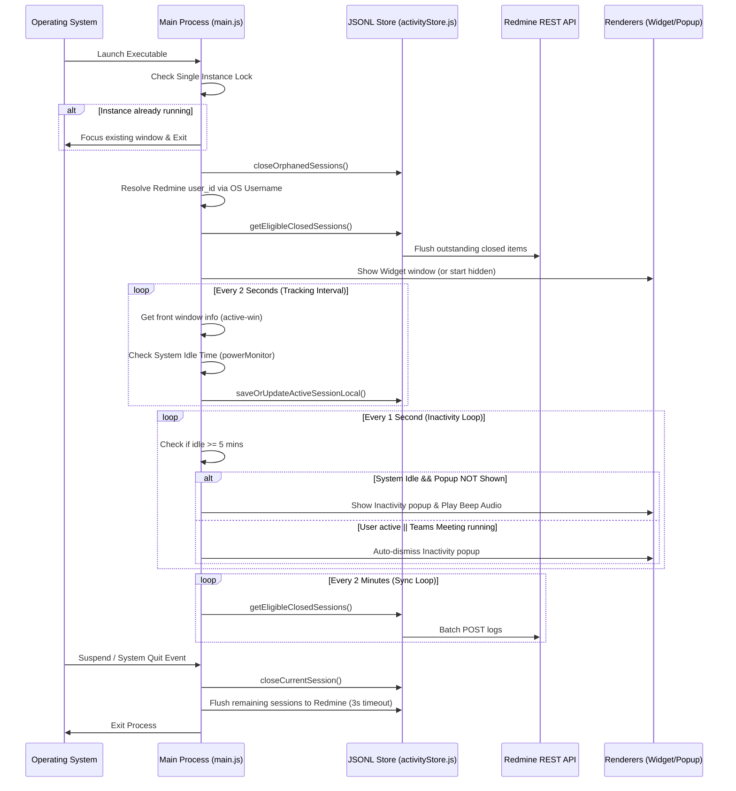
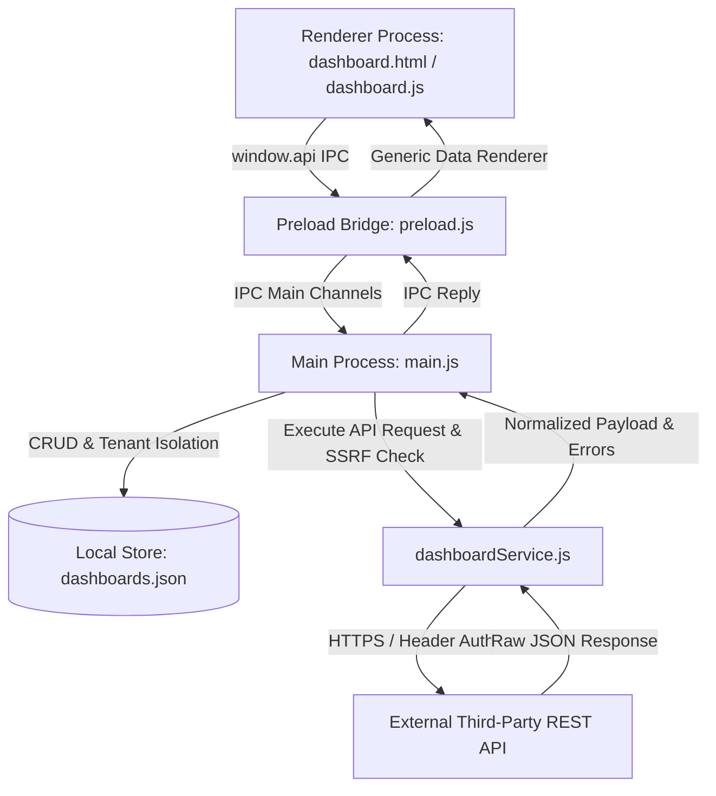

# WorkLens Desktop App | Technical Reference Manual (BRAIN.md)

This document is the single source of truth for the WorkLens Desktop Timelog & Activity Tracking application. It provides a complete conceptual, architectural, and detail-level breakdown of the project to enable any developer or AI assistant to be productive in under 2 minutes.

---

## 1. Project Overview

### Project Name
*   **WorkLens** (formerly *Daily Timelog*)

### Purpose & Problem Solved
WorkLens is a lightweight, system-level desktop productivity widget designed to track active and inactive working time. It automates employee timesheet logging by integrating with a Redmine-based backend, consolidating active window sessions locally, managing system sleep/resume/lock scenarios, and batch-uploading activity logs.
It solves:
1.  **Manual Timesheet Fatigue:** Eliminates the need for employees to track daily work logs manually.
2.  **API Server Overload:** Minimizes network requests on the backend by batching sync intervals (every 2 minutes) and consolidating similar sessions offline rather than sending telemetry every few seconds.
3.  **Inactivity Triggers:** Reminds users to stay focused when inactive via a nudge popup containing motivational quotes.

### Target Users
*   Employees tracking daily effort.
*   Redmine Administrators & Project Managers reviewing activity logs.

### Application Architecture
WorkLens is built on Electron's multi-process architecture. It consists of:
*   **Main Process:** Controls system-level events, active window tracking, idle state monitoring, power hooks (sleep/resume/lock/unlock), automated updates, and a local offline JSONL database.
*   **Renderer Processes:**
    1.  *Desktop Widget (`mainWindow`):* A minimalist, frameless desktop status window (185px × 60px) pinned to the bottom-right corner that displays username, date, Redmine Time Logs, and Active Time with live status dot. Clicking the widget opens the Dashboard window.
    2.  *WorkLens Dashboard (`dashboardWindow`):* A comprehensive, dark-themed SaaS desktop application window that opens maximized to fill the full desktop window (with restore dimensions of 1280px × 820px, resizable) featuring a left navigation sidebar, top search/user bar, Home overview (Project Tasks, IT Help Desk, and Admin Help Desk metrics, Recent Tasks table, Task Distribution donut chart, Upcoming Deadlines, Quick Actions, and Recent Activity timeline), and an integrated Active Time Dashboard view.
    3.  *Inactivity Nudge Card:* A transparent prompt playing audio alerts and displaying motivational quotes when idle time is exceeded.

```mermaid
graph TD
    A[Electron Main Process] -->|IPC / preload.js| B[Desktop Widget (index.html)]
    A -->|IPC / preload.js| C[Dashboard Window (dashboard.html)]
    A -->|IPC / preload.js| D[Inactivity Nudge (inactivityPopup.html)]
    A -->|redmineClient.js| E[Redmine Server REST API]
    A -->|activityStore.js| F[(Local Store: activity_queue.jsonl)]
    A -->|logger.js| G[(Daily Rotated Logs)]
```

---

## 2. Tech Stack

| Technology Layer | Solution | Version / Details |
| :--- | :--- | :--- |
| **Core Framework** | Electron | `^42.4.1` (Chromium + Node.js) |
| **Runtime Environment** | Node.js | Native inside Electron package |
| **Active Window Tracking** | `active-win` | `^8.2.1` (polls front window executable names/titles) |
| **Global Input Hook** | `uiohook-napi` | `^1.5.5` (global keyboard and mouse event listener) |
| **Local Cache Store** | JSON Lines File (JSONL) | `activity_queue.jsonl` managed in `%APPDATA%/WorkLens` |
| **API Client** | Native `fetch` wrapper | Standard JS fetch in Node.js (with custom header auth) |
| **Logging Utility** | `electron-log` | `^5.4.4` (7-day rotation, max 10MB per file) |
| **Auto Updates** | `electron-updater` | `^6.8.9` (releases synced via GitHub Provider) |
| **Configuration** | `dotenv` | `^16.4.5` (handles `.env` parsing) |
| **User Interface** | HTML5, CSS3, Vanilla JS | Fluent design elements, system beep audio via Web Audio API |
| **Build/Packaging System** | `electron-builder` | `^26.15.3` (NSIS target for Windows installer production) |

---

## 3. Folder Structure

The repository is structured to separate system-level logic from presentation assets.

```
WorkLens/
├── .agents/                    # Workspace agent customizations
├── assets/                     # Application assets
│   └── icon.png                # Main application icon (128x128px png)
├── dist/                       # Output folder for production builders (ignored)
├── node_modules/               # Dependencies (ignored)
├── renderer/                   # Front-end renderer window files
│   ├── index.html              # Desktop Widget layout (185px × 60px desktop status widget)
│   ├── renderer.js             # Desktop Widget controller (polls stats, opens Dashboard)
│   ├── style.css               # Desktop Widget styling
│   ├── dashboard.html          # WorkLens Reference Dashboard layout (Home & Active Time views)
│   ├── dashboard.js            # WorkLens Dashboard controller, navigation, and metrics
│   └── dashboard.css           # WorkLens Dashboard dark-theme styling
├── anti-afk/                   # Modular Behavior Analysis Engine
│   ├── config.js               # Thresholds, weights, and decision levels
│   ├── eventQueue.js           # Rolling in-memory event buffer
│   ├── eventCollector.js       # Event collection and formatting
│   ├── keyboardFeatures.js     # Keyboard metrics extraction
│   ├── mouseFeatures.js        # Mouse metrics (distance, speed, curvature, clicks)
│   ├── windowFeatures.js       # Window focus metrics (switches, stays, ping-pong)
│   ├── idleFeatures.js         # Idle status and wake-up patterns
│   ├── featureExtractor.js     # Primary feature extraction interface
│   ├── behaviorAnalyzer.js     # Indicators for suspicious behaviors
│   ├── scoreEngine.js          # Confidence scoring and developer overrides
│   ├── decisionEngine.js       # Classification (Human, Watch, Suspicious, Likely Automation)
│   └── antiAfkDetector.js      # Primary orchestrator and API endpoints
├── activityStore.js            # Offline database manager (handles JSONL operations and pruning)
├── antiAfkDetector.js          # Backward compatibility wrapper for the anti-AFK engine
├── dashboardStore.js           # Multi-tenant custom dashboard persistence & credential masking
├── dashboardService.js         # External API client with SSRF protection, timeouts & error formatting
├── CHANGELOG.md                # Evolution log of the desktop app
├── inactivityPopup.html        # Nudge UI & Web Audio beep synthesized tone code
├── logger.js                   # log configurations (resolves and purges logs older than 7 days)
├── main.js                     # Main Electron process driver (lifecycle, window creation, active-win tracking, dashboard IPC)
├── package.json                # Project configurations, builder targets, dependencies list
├── preload.js                  # IPC context bridge exposing APIs securely to renderer windows
├── quotes.js                   # Local quotes storage array for inactivity nudges
├── redmineClient.js            # Native fetch wrapper for Redmine HTTP REST requests
├── tests/                      # Automated test suite
│   └── dashboard.test.js       # Dynamic dashboard store, service, and renderer test suite
├── .env                        # Active environment configurations (not committed)
└── .env.example                # Example configuration template for environment setup
```

### Placement Guidelines
*   **Do Place in `renderer/`:** CSS files, scripts, and views that represent UI elements which run within a sandbox environment.
*   **Do Place in Root:** System-level logic modules, configuration structures, IPC interfaces, utility services, and state store files.
*   **Do NOT Place in `renderer/`:** Node modules imports, API clients directly making network requests, or direct filesystem access calls.

---

## 4. Entry Points

WorkLens has structured boundaries where processes start execution:

### 1. Main Process: [main.js](file:///c:/Users/karthikeya.kondavath/Desktop/Daily-Timelog-Main/WorkLens/main.js)
This is the application startup handler. Execution flows as follows:
*   Initializes the environment using `dotenv`.
*   Appends arguments like `--autoplay-policy=no-user-gesture-required` to enable automatic browser beep triggers.
*   Acquires the single-instance lock via `app.requestSingleInstanceLock()`.
*   Sets up system tray hooks and registers background loops:
    *   **Inactivity Check Interval (1 sec):** Closed-loop verification of user idle status.
    *   **Activity Tracking Tick (2 sec):** Queries active window titles and appends/consolidates them.
    *   **Flush Sync Worker (2 min):** Flushes local cache records to the Redmine API.
*   Executes update validations and binds power monitor state listeners (suspend, resume, lock, unlock).

### 2. IPC Context Bridge: [preload.js](file:///c:/Users/karthikeya.kondavath/Desktop/Daily-Timelog-Main/WorkLens/preload.js)
The bridge scripts run before renderer files load. It exposes a restricted `window.api` namespace containing method call mappings. It acts as a security barrier preventing the UI from executing arbitrary Node.js scripts.

### 3. Renderer Scripts
*   **[renderer/renderer.js](file:///c:/Users/karthikeya.kondavath/Desktop/Daily-Timelog-Main/WorkLens/renderer/renderer.js):** Coordinates values displayed by the Desktop Widget (`renderer/index.html`). Handles clicks on the "Active Time" and "Time Logs" cards to open the full Dashboard window, and handles hide-to-tray actions.
*   **[renderer/dashboard.js](file:///c:/Users/karthikeya.kondavath/Desktop/Daily-Timelog-Main/WorkLens/renderer/dashboard.js):** Coordinates UI views and real-time state for the WorkLens Dashboard (`renderer/dashboard.html`). Handles tab navigation (Home, Active Time Dashboard, Project Tasks, IT Help Desk, Admin Help Desk), search filtering, task creation modals, notification dropdowns, live telemetry polling, and desktop window controls.

---

## 5. Application Flow

The lifecycle flow of the application from startup to shutdown is structured as follows:



---

## 6. Feature Documentation

### 1. Frameless Widget Panel
*   **Purpose:** Provide employees with a non-intrusive status interface showing their recorded and logged times.
*   **Files Involved:** 
    *   [renderer/index.html](file:///c:/Users/karthikeya.kondavath/Desktop/Daily-Timelog-Main/WorkLens/renderer/index.html)
    *   [renderer/style.css](file:///c:/Users/karthikeya.kondavath/Desktop/Daily-Timelog-Main/WorkLens/renderer/style.css)
    *   [renderer/renderer.js](file:///c:/Users/karthikeya.kondavath/Desktop/Daily-Timelog-Main/WorkLens/renderer/renderer.js)
*   **UI Metrics Displayed:** 
    *   *Time Logs (Redmine Summary):* Shows yesterday's (Y) and today's (T) logged times returned by Redmine.
    *   *Active Time (Local Tracked Time):* Shows local tracked active time yesterday (Y) and today (T).
    *   *Status Dot:* A pulsing indicator representing "Active (Online)" (Green), "Active (Offline)" (Blue), or "Inactive" (Orange) states.
    *   *Close Button:* A Fluent-style close button (`widget-close-btn`) next to the date display. Clicking it gracefully hides the main widget and detail popup to run in the background (restorable via the system tray).

### 2. Active Window Tracking
*   **Purpose:** Continuously poll the top-most window in the OS to track where the user's attention is focused.
*   **Files Involved:**
    *   [main.js](file:///c:/Users/karthikeya.kondavath/Desktop/Daily-Timelog-Main/WorkLens/main.js) (tracking tick, active-win binding)
*   **Key Logic Rules:**
    *   **Lock Screen Exclusion:** Active tracking is suspended, and the status is set to `Inactive` if `lockapp.exe` (Windows Lock Screen) is detected.
    *   **Teams Call/Meeting Detection:** Forces status to `Active` even if keyboard/mouse activity is idle, provided the active window title matches meeting/call identifiers (e.g., `\bmeeting\b`, `\bcall\b`, `\bpresenting\b`).
    *   **Passive Transfer Detection:** Flags active transfers (WinSCP or downloads matching percentage progress keywords like `\b\d{1,3}%\s+(downloading|uploading|transferring)\b`) as `Inactive` since they are running in the background.
    *   **Title Normalization:** Normalizes volatile percentage titles (e.g., "82% transferring") to static titles (e.g., "Transferring in progress") to prevent polluting the database.

### 3. Session Consolidation & Local Queue
*   **Purpose:** Consolidate active intervals into single rows in the database (up to 1 hour max) to limit server synchronization load.
*   **Files Involved:**
    *   [activityStore.js](file:///c:/Users/karthikeya.kondavath/Desktop/Daily-Timelog-Main/WorkLens/activityStore.js)
*   **Consolidation Criteria:** If app name, window title, activity status, and target tracking day match the current record, update the existing session's end time and duration instead of creating a new row. If any parameter changes, the current session is closed and queued for synchronization.

### 4. Inactivity Nudge
*   **Purpose:** Prompt employees visually and audibly when the workstation registers no keyboard or mouse inputs for more than 5 minutes.
*   **Files Involved:**
    *   [main.js](file:///c:/Users/karthikeya.kondavath/Desktop/Daily-Timelog-Main/WorkLens/main.js)
    *   [quotes.js](file:///c:/Users/karthikeya.kondavath/Desktop/Daily-Timelog-Main/WorkLens/quotes.js)
    *   [inactivityPopup.html](file:///c:/Users/karthikeya.kondavath/Desktop/Daily-Timelog-Main/WorkLens/inactivityPopup.html)
*   **Behavior Details:** Plays a dual-tone beep at 800Hz for 120ms (repeated after a 250ms delay). Auto-closes when user activity is detected, or after a 15-second timeout if no interaction occurs.

### 5. Integrated Active Time Dashboard View
*   **Purpose:** Provide users with an interactive, categorized breakdown of their active time per application, telemetry indicators, today/yesterday comparisons, and Redmine synchronization metrics directly within the WorkLens desktop application.
*   **Files Involved:** 
    *   [renderer/dashboard.html](file:///c:/Users/karthikeya.kondavath/Desktop/Daily-Timelog-Main/WorkLens/renderer/dashboard.html)
    *   [renderer/dashboard.css](file:///c:/Users/karthikeya.kondavath/Desktop/Daily-Timelog-Main/WorkLens/renderer/dashboard.css)
    *   [renderer/dashboard.js](file:///c:/Users/karthikeya.kondavath/Desktop/Daily-Timelog-Main/WorkLens/renderer/dashboard.js)
*   **Mechanics:**
    *   *Navigation:* Accessible directly from the sidebar via the "Active time dashboard" button.
    *   *Telemetry Cards:* Displays Today Active Time, Yesterday Active Time, Today Redmine Effort, and Yesterday Redmine Effort alongside a live pulsing status pill (`Active`, `Inactive`, or `Offline`).
    *   *Application Breakdown:* Aggregates local offline queue logs and remote Redmine logs, calculates duration and relative usage percentage bars, and maps cached application icons.
    *   *Manual Sync:* Includes a "Sync Now" action to immediately trigger an offline-queue sync via `window.api.triggerSync()`.
*   **Icon Caching:** Resolves executable file icons on the main thread using standard shell queries (`Get-Process`) and converts them to base64 images to prevent CPU overhead in the rendering process.

### 6. Anti-AFK & Enterprise Behavior Analysis Engine
*   **Purpose:** Exclude fake or automated activity from active time logs by continuously collecting user interaction events and extracting features to detect key-weights, mouse jigglers, and window focus loops.
*   **Files Involved:**
    *   [anti-afk/antiAfkDetector.js](file:///c:/Users/karthikeya.kondavath/Desktop/Daily-Timelog-Main/WorkLens/anti-afk/antiAfkDetector.js) (Pipeline Orchestration)
    *   [anti-afk/config.js](file:///c:/Users/karthikeya.kondavath/Desktop/Daily-Timelog-Main/WorkLens/anti-afk/config.js) (Weights & Threshold Constants)
    *   [anti-afk/eventQueue.js](file:///c:/Users/karthikeya.kondavath/Desktop/Daily-Timelog-Main/WorkLens/anti-afk/eventQueue.js) & [anti-afk/eventCollector.js](file:///c:/Users/karthikeya.kondavath/Desktop/Daily-Timelog-Main/WorkLens/anti-afk/eventCollector.js) (Rolling 300s Queue & Formatter, evaluated over a 60s window)
    *   [anti-afk/keyboardFeatures.js](file:///c:/Users/karthikeya.kondavath/Desktop/Daily-Timelog-Main/WorkLens/anti-afk/keyboardFeatures.js), [anti-afk/mouseFeatures.js](file:///c:/Users/karthikeya.kondavath/Desktop/Daily-Timelog-Main/WorkLens/anti-afk/mouseFeatures.js), [anti-afk/windowFeatures.js](file:///c:/Users/karthikeya.kondavath/Desktop/Daily-Timelog-Main/WorkLens/anti-afk/windowFeatures.js), [anti-afk/idleFeatures.js](file:///c:/Users/karthikeya.kondavath/Desktop/Daily-Timelog-Main/WorkLens/anti-afk/idleFeatures.js) (Statistical Feature Extractors)
    *   [anti-afk/behaviorAnalyzer.js](file:///c:/Users/karthikeya.kondavath/Desktop/Daily-Timelog-Main/WorkLens/anti-afk/behaviorAnalyzer.js) (Suspicious Behavior Identification)
    *   [anti-afk/scoreEngine.js](file:///c:/Users/karthikeya.kondavath/Desktop/Daily-Timelog-Main/WorkLens/anti-afk/scoreEngine.js) (Confidence scoring with developer false-positive bypasses)
    *   [anti-afk/decisionEngine.js](file:///c:/Users/karthikeya.kondavath/Desktop/Daily-Timelog-Main/WorkLens/anti-afk/decisionEngine.js) (Classifies score levels: Human, Watch, Suspicious, Likely Automation)
    *   [main.js](file:///c:/Users/karthikeya.kondavath/Desktop/Daily-Timelog-Main/WorkLens/main.js) (Fires hardware uIOhook key/mouse/scroll triggers and polls idle status)
*   **Behavioral Indicators & Weights:**
    *   `sameKeyRatio` (+25): Same key accounts for >= 95% of keyboard input in the rolling window.
    *   `lowEntropy` (+15): Shannon entropy < 1.0, indicating highly predictable or repeating key patterns.
    *   `constantInterval` (+20): Keystroke intervals have standard deviation < 15ms, showing regular artificial timing.
    *   `periodicClicks` (+15): Click intervals have standard deviation < 20ms.
    *   `pingPongSwitch` (+15): Switching back and forth (A-B-A-B) between windows. Bypassed for active developers if they show natural typing/clicks inside those windows.
    *   `noMouseMovement` (+10): Zero mouse movements, clicks, or scrolls in the rolling window.
    *   `longKeyHold` (+30): A key is held down continuously for >= 30 seconds. This also directly triggers the suspicious state.
    *   `windowSwitchWithoutInteraction` (+20): Window focus switches occur without corresponding key/mouse actions inside the windows.
    *   `softwareWindowSwitch` (+80): Window focus switches occur without any physical keyboard or mouse events (e.g. software API focus manipulation). Directly triggers suspicious state.
    *   `artificialIdleRecovery`: Resume/unlock followed immediately by window switching without input events.
*   **Loophole Prevention & Graceful Recovery:**
    *   **Window Switch Loophole Fixed**: Switching active windows no longer resets the suspicion status. Only genuine user interaction (different key pressed, natural curved mouse movement, scroll, or click) can reduce suspicion.
    *   **Recovery Mechanics**: If flagged as suspicious/automation, only genuine content keypresses (excludes control/modifier keys like Alt/Tab), mouse clicks, scrolls, or natural curved mouse movements (segment lengths > 3px, angle change between 0.05 and 3.0 rad, excluding sharp reversals) will clear the flag, flush the event queue, and reset suspicion.

---

## 7. API Documentation

All API communications are handled in [redmineClient.js](file:///c:/Users/karthikeya.kondavath/Desktop/Daily-Timelog-Main/WorkLens/redmineClient.js). Requests require the `REDMINE_API_KEY` token, which is passed in the query parameters (`?key=...`) and as the `X-Redmine-API-Key` header.

### 1. User Account Resolution
*   **URL:** `GET /users.json`
*   **Parameters:** `name=<os_username>&limit=100`
*   **Purpose:** Fetch the user object matching the logged-in OS username to retrieve the Redmine user ID.
*   **Response Shape:**
    ```json
    {
      "users": [
        { "id": 42, "login": "karthikeya.k" }
      ]
    }
    ```

### 2. Logged Effort Timesheet
*   **URL:** `GET /today_timesheet.json`
*   **Parameters:** `user_id=<os_username>`
*   **Purpose:** Fetch total working hours logged today and yesterday in Redmine.
*   **Response Shape:**
    ```json
    {
      "user": { "id": 42, "name": "Karthikeya Kondavathri" },
      "yesterday": { "date": "2026-07-26", "hours": "7.5" },
      "today": { "date": "2026-07-27", "hours": "2.0" }
    }
    ```

### 3. Tracked Activity Summary
*   **URL:** `GET /user_system_activity_logs/summary.json`
*   **Parameters:** `user_id=<os_username>`
*   **Purpose:** Retrieve total active duration hours recorded on the server for today and yesterday.
*   **Response Shape:**
    ```json
    {
      "user_id": 42,
      "yesterday": { "date": "2026-07-26", "duration_hours": "6.83" },
      "today": { "date": "2026-07-27", "duration_hours": "1.5" }
    }
    ```

### 4. Today's Activity Details Log
*   **URL:** `GET /user_system_activity_logs/today.json`
*   **Parameters:** `user_id=<user_id>`
*   **Purpose:** Retrieve the full, raw list of activity logs registered today.
*   **Response Shape:**
    ```json
    {
      "entries": [
        {
          "id": 10043,
          "user_id": 42,
          "app_name": "Visual Studio Code",
          "window_title": "main.js - WorkLens",
          "start_time": "2026-07-27T10:00:00",
          "end_time": "2026-07-27T10:45:00",
          "duration": 2700,
          "status": "active"
        }
      ]
    }
    ```

### 5. Submit Session Log
*   **URL:** `POST /user_system_activity_logs.json`
*   **Body Payload:**
    ```json
    {
      "user_id": 42,
      "app_name": "Google Chrome",
      "window_title": "WorkLens - Pull Requests",
      "start_time": "2026-07-27T11:00:00",
      "end_time": "2026-07-27T11:05:00",
      "duration": 300,
      "activity_on": "2026-07-27",
      "status": "active"
    }
    ```
*   **Sync Behavior:** Batched every 2 minutes. Failed logs are retried with an exponential backoff delay.

---

## 8. Database Documentation

WorkLens uses a lightweight offline store implemented as a JSON Lines (JSONL) file rather than a heavy SQLite database engine.

*   **File Path:** `%APPDATA%/WorkLens/activity_queue.jsonl` (Resolved dynamically via `app.getPath('userData')`).
*   **Format:** Each line is a valid JSON string representing an activity log entry.

### Schema Properties

| Field Name | Type | Description |
| :--- | :--- | :--- |
| `local_id` | String | Unique UUID generated on the client. |
| `user_id` | Integer / Null | The resolved Redmine User ID. |
| `app_name` | String | Tracked executable application name (e.g., `chrome.exe`). |
| `window_title` | String | Window header title at the time of tracking. |
| `start_time` | String (ISO) | ISO start timestamp formatted in local system time. |
| `end_time` | String (ISO) | ISO end timestamp formatted in local system time. |
| `duration` | Integer | Total elapsed active time in seconds. |
| `activity_on` | String | Calendar log target date (`YYYY-MM-DD`). |
| `status` | String | Status flags (`active` or `inactive`). |
| `closed` | Boolean | True if the session has ended and is ready to sync. |
| `synced` | Boolean | True if the record has been uploaded to the Redmine API. |
| `retry_count` | Integer | Number of failed upload attempts. |
| `last_error` | String / Null | Error message from the last failed sync attempt. |
| `created_at` | String (ISO) | Local record creation timestamp. |
| `updated_at` | String (ISO) | Local record modification timestamp. |

### Data Pruning & Optimization
To keep the storage size optimized, the write routine in [activityStore.js](file:///c:/Users/karthikeya.kondavath/Desktop/Daily-Timelog-Main/WorkLens/activityStore.js#L71-L93) automatically prunes synced records that are older than 1 day from the `activity_queue.jsonl` file.

---

## 9. State Management

WorkLens manages application state across memory and local storage:

```
┌────────────────────────────────────────────────────────┐
│                      MEMORY STATE                      │
│                                                        │
│  currentRecord: Current active tracking session block   │
│  cachedUserId: Resolved numeric Redmine user ID        │
│  appIconCache: Base64 icons mapped by app name         │
│  cachedActiveTimeToday/Yesterday: Tracker cache        │
│  activitySummaryCache: 5s API responses cache          │
└──────────┬──────────────────────────────────▲──────────┘
           │ Writes                           │ Reads
           ▼                                  │
┌─────────────────────────────────────────────┴──────────┐
│                   PERSISTENT STORAGE                   │
│                                                        │
│  activity_queue.jsonl: Unsynced & recently synced logs │
│  logger.js (Logs folder): Local troubleshooting logs   │
└────────────────────────────────────────────────────────┘
```

*   **Temporary Memory Buffers:** Keeps current trackers and user sessions in memory for fast performance.
*   **Summary Caching:** Caches activity summaries for 5 seconds to prevent concurrent requests to the Redmine API when updating the widget.

---

## 10. IPC & Event Flow

Preload bridges access paths by mapping handlers across processes:

| IPC Channel | Direction | Payload | Purpose |
| :--- | :--- | :--- | :--- |
| `get-username` | Invoked by UI | None | Returns `{ username: string, error: string|null }` containing OS username and Redmine connection error details. |
| `get-employee-id` | Invoked by UI | None | Returns numeric Redmine ID. |
| `get-app-version` | Invoked by UI | None | Returns active semantic version string. |
| `get-redmine-efforts` | Invoked by UI | None | Returns today's and yesterday's logged times. |
| `get-active-time-today` | Invoked by UI | None | Returns total local tracked seconds today (including unsynced). |
| `get-active-time-yesterday` | Invoked by UI | None | Returns total local tracked seconds yesterday. |
| `get-current-status` | Invoked by UI | None | Returns active state (`Active`/`Inactive`). |
| `open-dashboard` | Invoked by UI | None | Creates/shows and focuses the WorkLens Dashboard window. |
| `close-dashboard` | Invoked by UI | None | Hides the WorkLens Dashboard window. |
| `show-main-window` | Invoked by UI | None | Focuses and restores the Desktop Widget on screen. |
| `window-minimize` | Invoked by UI | None | Minimizes the active desktop window. |
| `window-maximize` | Invoked by UI | None | Toggles maximize / restore for the dashboard window. |
| `is-window-maximized` | Invoked by UI | None | Returns boolean (`true`/`false`) indicating if the active window is currently maximized. |
| `window-state-changed` | Main to UI | `{ isMaximized: boolean }` | WebContents event fired on window maximize/unmaximize to synchronize UI control states. |
| `window-close` | Invoked by UI | None | Hides the active desktop window to background/tray. |
| `close-inactivity-popup`| Invoked by UI | None | Closes/destroys the inactivity nudge window. |
| `fetch-activity-logs` | Invoked by UI | None | Returns sorted today logs + icon base64 mappings for the Active Time dashboard view. |
| `trigger-sync` | Invoked by UI | None | Explicitly triggers an offline-queue sync. |
| `hide-main-window` | Invoked by UI | None | Gracefully hides the main window, running tracking in the background. |

---

## 11. Background Jobs

WorkLens runs several key background processes:

### 1. Activity Monitoring Tick
*   **Interval:** Every 2 seconds.
*   **Logic:** Polls `active-win` and `powerMonitor.getSystemIdleTime()`. Updates the current in-memory record and persists updates to the local JSONL queue.

### 2. Inactivity Monitor Loop
*   **Interval:** Every 1 second.
*   **Logic:** Monitors system idle time. Shows the inactivity nudge window if idle time exceeds 5 minutes (`INACTIVITY_THRESHOLD_SECONDS = 300`).

### 3. Sync Flush Task
*   **Interval:** Every 2 minutes.
*   **Logic:** Uploads closed, unsynced sessions from the queue to Redmine.
*   **Retry Handling:** Implements exponential backoff (`2^(retry_count - 1)` minutes, up to a maximum of 60 minutes) for failed logs.

### 4. Auto Update Checker
*   **Interval:** On startup, and repeated every 4 hours.
*   **Logic:** Calls GitHub release endpoints to download and install updates.

### 5. Startup Cleanup Tasks
*   Closes orphaned sessions (where `closed: false` from a previous session).
*   Prunes log files older than 7 days from the logs folder.

### 6. User Resolution Retry Loop
*   **Interval:** Every 30 seconds.
*   **Logic:** Retries validating the local Windows username against the Redmine backend `/today_timesheet.json` API. If validation fails (due to backend username changes), all tracking services are stopped immediately. If validation succeeds again, cached user info is updated and all tracking/sync services are resumed automatically. Allows recovering user IDs from local queues during offline boot-up.

---

## 12. Configuration & Environment

Configuration parameters are loaded from the environment:

*   **`REDMINE_BASE_URL`:** The endpoint domain hosting the target timesheet interface.
*   **`REDMINE_API_KEY`:** Access token permissions associated with client write actions.
*   **`app.isPackaged` Resolution:** In development, config parameters are loaded from the project root directory. In production, they are loaded from `.env` in the packaged resources directory (`process.resourcesPath`).

### Hardcoded Configuration Constants

```javascript
const INACTIVITY_THRESHOLD_SECONDS = 300; // 5 mins idle limit
const IDLE_CHECK_INTERVAL_MS = 1000;       // 1s idle status verification
const POPUP_AUTO_CLOSE_MS = 15000;         // 15s nudge auto-close timeout
```

---

## 13. External Integrations

### Redmine Server
*   **Authentication:** API token auth via the `X-Redmine-API-Key` header and the `?key=` query parameter.
*   **Payload Types:** JSON payload formatting is used for all transactions.

### GitHub Releases
*   **Target Integration:** Automated updates using `electron-updater`.
*   **Repository Configuration:** Configured in `package.json`:
    ```json
    "publish": {
      "provider": "github",
      "owner": "karthikeyaabm",
      "repo": "worklens",
      "releaseType": "release"
    }
    ```

---

## 14. Build & Release Process

WorkLens uses `electron-builder` to package the application.

```bash
# 1. Run widget in development mode
npm start

# 2. Package installer files for Windows (.exe installer via NSIS)
npm run build

# 3. Publish builds to GitHub Releases (runs updater pipelines)
npm run release
```

### Packaging Details
*   **Application ID:** `com.worklens.desktop`
*   **Resources Packaging:** The `.env` configuration file is included in the application bundle using the `extraResources` copy filter.

---

## 15. Coding Standards

*   **Separation of Concerns:** Keep OS API calls, window states, and process logic in the Main Process. Renderer files should focus on UI rendering and styles.
*   **Secure Preload Exposure:** Do not expose Node's `require` or native bindings to the renderer. Use the context bridge to define APIs.
*   **Robust Error Handling:** Wrap all API requests and window tracking calls in `try-catch` blocks to prevent crashes on network failures or application switches.
*   **User Path Safety:** Use `app.getPath('userData')` to resolve file paths. Do not use hardcoded root folders.
*   **Time Tracking Units:** Use seconds for logs in the database. Convert these to decimal hours (e.g., `1.5h`) when displaying them in the UI.

---

## 16. Known Issues & Limitations

1.  **Browser Title Overloads:** Tracking browser windows can create multiple short log entries when switching tabs rapidly. (Mitigated by the 2-minute sync interval and session consolidation rules).
2.  **OS Support:** Platform-specific window titles (such as the Windows lock screen `lockapp.exe`) must be configured manually for other operating systems.
3.  **Active Teams Override:** System idle checks are bypassed during active Teams calls, which relies on the window title containing meeting-related words.

---

## 17. TODO Roadmap

*   [ ] **Ignore List UI:** Allow users to filter out specific processes (such as games or system apps) from being tracked.
*   [ ] **Category Mapping:** Automatically group application logs into categories like "Development", "Meetings", or "System Admin".
*   [ ] **Manual Log Correction:** Allow users to correct or manually adjust recorded time logs before they sync to Redmine.
*   [ ] **Cross-Platform Support:** Extend window tracking and system idle detection to macOS and Linux.

---

## 18. Important Business Logic

### Session Consolidation Algorithm
*   Calculates active intervals by comparing process parameters every 2 seconds.
*   If `appName`, `windowTitle`, `status`, and `day` match the current record, the active session is updated.
*   If the app changes, the system locks, or a new day begins, the current session is closed and written to the JSONL queue.

### Active/Inactive State Resolution

```
                  ┌──────────────────────────┐
                  │   Is Workstation Locked  │
                  │   (e.g., lockapp.exe)?   │
                  └────────────┬─────────────┘
                               │
                      Yes ┌────┴────┐ No
            ┌─────────────┴─┐     ┌─┴────────────────────────┐
            │ Flag INACTIVE │     │ Is System Idle >= 5m     │
            └───────────────┘     │ (Keyboard/Mouse Inactive)│
                                  └──────────┬───────────────┘
                                             │
                                    Yes ┌────┴────┐ No
                          ┌─────────────┴─┐     ┌─┴────────────────────────┐
                          │ Is Active MS  │     │ Is Volatile Transfer     │
                          │ Teams Call?   │     │ (WinSCP / Download)?     │
                          └──────┬────────┘     └──────────┬───────────────┘
                                 │                         │
                        Yes ┌────┴────┐ No        Yes ┌────┴────┐ No
                  ┌─────────┴─┐   ┌───┴─────┐   ┌─────┴─────┐   ┌───┴─────┐
                  │Flag ACTIVE│   │  Flag   │   │   Flag    │   │  Flag   │
                  └───────────┘   │INACTIVE │   │ INACTIVE  │   │ ACTIVE  │
                                  └─────────┘   └───────────┘   └─────────┘
```

---

## 19. Security Notes

*   **API Credentials:** Keep the `REDMINE_API_KEY` token secure in the `.env` file. Do not commit `.env` files to git.
*   **Execution Sandbox:** Keep `nodeIntegration` disabled and `contextIsolation` enabled in all BrowserWindow instances to prevent unauthorized shell access.

---

## 20. Performance Notes

*   **Request De-duplication:** Employs an in-flight promise lock (`activitySummaryInFlight`) in [main.js](file:///c:/Users/karthikeya.kondavath/Desktop/Daily-Timelog-Main/WorkLens/main.js#L830) to prevent parallel requests from overwhelming the server when renderers load.
*   **Process Icon Caching:** Base64 icons are cached in memory to reduce shell execution overhead when resolving application icons.
*   **Pruning Synced Logs:** Prunes synced logs older than 1 day from the JSONL queue on every write to maintain a small database size.

---

## 21. Testing

### Manual Testing
1.  **Network Offline Test:** Disconnect from the network, run the app, and verify that activity logs are saved to the JSONL file. Reconnect to the network and verify that logs are successfully synced.
2.  **Inactivity Verification:** Leave the workstation idle for 5 minutes and verify that the inactivity nudge popup appears with an audio beep. Move the mouse and verify that the popup auto-dismisses.
3.  **App Switcher Test:** Open multiple apps (e.g., VS Code, Chrome, Terminal) and verify that the activity breakdown popup displays the active time distribution correctly.

---

## 22. Debugging Guide

*   **Main Process Logs:** Located in `%APPDATA%/WorkLens/logs/worklens-YYYY-MM-DD.log`.
*   **Renderer DevTools:** To debug the UI, temporarily enable DevTools in `main.js`:
    ```javascript
    mainWindow.webContents.openDevTools();
    ```

---

## 23. Dependency Map

```
  ┌────────────────────────────────────────────────────────┐
  │                        main.js                         │
  └────┬──────────────┬──────────────┬──────────────┬──────┘
       │              │              │              │
       ▼              ▼              ▼              ▼
┌────────────┐ ┌────────────┐ ┌────────────┐ ┌────────────┐
│ preload.js │ │logger.js   │ │activity-   │ │redmine-    │
│            │ │            │ │Store.js    │ │Client.js   │
└──────┬─────┘ └────────────┘ └────────────┘ └────────────┘
       │
       ▼
┌────────────┐
│ renderers  │
└────────────┘
```

---

## 24. Dynamic Dashboard Creation & API Integration System

WorkLens includes a dynamic dashboard management and external API integration system. Users can create, test, and manage custom API dashboards directly from a dedicated **Settings** interface. Newly created dashboards are automatically mounted in the main sidebar without restarting or reloading the application.



### 1. Data Model & Storage (`dashboardStore.js`)
Dashboards are persisted locally in `%APPDATA%/WorkLens/dashboards.json` (or `.worklens-data/dashboards.json` in development).

```json
{
  "id": "dash_a1b2c3d4",
  "company_id": "default-company",
  "name": "IT Desk",
  "endpoint": "https://api.example.com/tickets",
  "method": "GET",
  "auth_type": "bearer",
  "credentials": {
    "token": "raw-secret-token",
    "username": "",
    "password": ""
  },
  "status": "connected",
  "created_by": "Karthikeya",
  "created_at": "2026-09-15T10:00:00.000Z",
  "updated_at": "2026-09-15T10:00:00.000Z"
}
```

*   **Credential Masking:** Tokens are never returned to the renderer process in plain text. On `listDashboards` and `getDashboard`, credentials are sanitized as `{ hasToken: true, maskedToken: "••••••••" }`.
*   **Tenant Isolation:** Dashboards are keyed by `company_id` (defaulting to `process.env.TENANT_ID || 'default-company'`). Tenants can never access or overwrite dashboards belonging to another organization. Duplicate dashboard names are prohibited within the same tenant.
*   **Role Authorization:** `Admin` and `Manager` roles are authorized to create, update, and delete dashboards. `Employee` users are restricted to read-only viewing.

### 2. External API Service & Security (`dashboardService.js`)
*   **SSRF Protection:** Loopback addresses (`127.0.0.1`, `localhost`, `0.0.0.0`, `::1`) and private RFC-1918 subnets (`10.0.0.0/8`, `192.168.0.0/16`, `172.16.0.0/12`, `169.254.0.0/16`) are blocked by default to prevent internal network scanning. Can be bypassed for local mock testing by setting `ALLOW_LOCAL_DASHBOARD_APIS=true`.
*   **Protocol Enforcement:** Only `http:` and `https:` schemes are accepted; dangerous URI protocols like `javascript:`, `file:`, or `data:` are rejected immediately.
*   **Authentication Schemes:**
    *   `Bearer Token`: Injects `Authorization: Bearer <token>`.
    *   `API Key`: Injects `X-API-Key: <token>` and `Authorization: ApiKey <token>`.
    *   `Basic Auth`: Injects `Authorization: Basic <base64(user:pass)>`.
    *   `No Authentication`: Standard outbound request without auth headers.
*   **Timeouts & Error Mapping:** 10-second timeout managed via `AbortController`. Standardized friendly error messages for HTTP 401, 403, 404, 429, 500+, timeouts, and invalid JSON payloads.

### 3. IPC Communication Channels

| IPC Channel | Direction | Payload | Return Value | Purpose |
| :--- | :--- | :--- | :--- | :--- |
| `dashboards:list` | Renderer -> Main | `{ companyId?, role? }` | `Dashboard[]` (masked) | Fetch all dashboards for current tenant |
| `dashboards:get` | Renderer -> Main | `id` | `Dashboard` (masked) | Retrieve single dashboard metadata |
| `dashboards:create` | Renderer -> Main | `{ name, endpoint, method, authType, token, ... }` | `Dashboard` (masked) | Create and persist new dashboard |
| `dashboards:update` | Renderer -> Main | `{ id, ...updates }` | `Dashboard` (masked) | Update existing dashboard |
| `dashboards:delete` | Renderer -> Main | `id` | `{ success: true, id }` | Remove dashboard from store |
| `dashboards:test` | Renderer -> Main | `{ endpoint, method, authType, token, ... }` | `{ success, message, sample? }` | Test API connection before creating |
| `dashboards:fetch-data` | Renderer -> Main | `id` | `{ success, data?, error?, status }` | Proxy third-party API call using stored credentials |

### 4. UI Components & User Experience
*   **Settings View (`#view-settings`):** Accessible from the sidebar. Contains the **Dashboard Management** table showing Dashboard Name, API Endpoint, HTTP Method, Authentication Type, Live Status Badge, and Action buttons (`Test`, `View`, `Edit`, `Delete`). Displays an empty state banner when no custom dashboards exist.
*   **Create / Edit Dashboard Modal (`#dashboard-modal`):**
    *   Fields: Dashboard Name (2-50 chars, unique), API Endpoint (valid URL), HTTP Method (GET/POST), Authentication Type (API Key, Bearer, Basic, None), Masked API Key/Token with toggle visibility button.
    *   **Pre-creation API Test:** Clicking "Create Dashboard" automatically triggers an API connectivity pre-test with visual loading spinner and "Testing API...". Only successful API responses proceed to save the configuration.
    *   **Viewport & Alignment Safeguards:** Modal card is constrained to `max-height: 85vh` with a scrollable `modal-body` (`max-height: calc(85vh - 130px)`) and fixed header/footer (`flex-shrink: 0`) to prevent modal clipping on standard laptop displays. Alert boxes and test banners enforce strict SVG dimensions (`18px x 18px`) and inline/CSS hidden toggle rules (`.modal-alert-box.hidden`, `.test-spinner.hidden`) to prevent unconstrained icon expansion and layout displacement.
*   **Delete Confirmation Modal (`#dashboard-delete-modal`):** Prompts for confirmation before permanent removal.
*   **Dynamic Sidebar Integration:** Newly created dashboards immediately appear under the `CUSTOM DASHBOARDS` header in the sidebar without page reload.
*   **Dynamic Route & View (`#/dashboard/:id`):**
    *   Header: Dynamic dashboard name, endpoint path, live status pill (`Connected` / `Error`), and actions (`Refresh`, `Edit`, `Delete`).
    *   **Generic Data Renderer:**
        1.  *Numeric KPI Cards Grid:* Automatically detects and displays numeric metric counters (e.g. `totalTickets: 120`, `openTickets: 40`).
        2.  *Interactive Data Table:* Detects root arrays or nested collections (`tickets`, `data`, `items`, `records`), generates dynamic column headers, formats badges for status/priority, and includes live text search filtering.
        3.  *Key-Value Attributes Card:* Renders object metadata and scalar properties.
        4.  *Raw JSON Inspector:* Collapsible formatted JSON payload viewer for developers.

### 5. Automated Verification
A comprehensive test suite is located in `tests/dashboard.test.js` and can be run via:
```powershell
npm test
```
Covers store persistence, name uniqueness, tenant isolation, role authorization, SSRF blocking, auth headers, API proxying, and generic renderer parsing logic.

---

## 25. AI Development Rules

When adding features or modifying code in WorkLens, AI assistants must adhere to the following rules:

### 1. Code Style Guidelines
*   Write modular CommonJS code in the main process and modern ES modules in the renderer.
*   Keep helper utilities focused and reusable.
*   Ensure all API requests have timeout handling.

### 2. Forbidden Modifications
*   **Do NOT expose native Node APIs directly to the renderer.** Always route communication through the context bridge in `preload.js`.
*   **Do NOT remove file-archival or pruning routines.** Database and log files must be kept small.
*   **Do NOT store sensitive API keys in plaintext in frontend renderer state permanently.**

### 3. Review Checklist for Changes
- [ ] Verify that UI changes work on Windows 11 and match the Fluent/glassmorphism design guidelines.
- [ ] Confirm that all database operations run asynchronously and do not block the main process thread.
- [ ] Check that new API endpoints have proper error handling and fallback values.
- [ ] Ensure all code changes are accurately reflected in `BRAIN.md`.

---

## 26. Change Log Summary

*   **v1.0.1 - Initial Version:** Frameless widget layout with active window tracking.
*   **v1.0.7 - System Tray:** Runs in the system tray with single-instance locking.
*   **v1.0.8 - Fluent Popup:** Detailed activity log breakdown popup with base64 icon caching.
*   **v1.0.9 - Inactivity Nudge:** Visual popups with audio alerts for idle sessions.
*   **v1.1.0 - Offline Sync:** JSONL-based local storage queue with automatic retry handling and session consolidation.
*   **v1.1.1 - Expandable Activity Details:** Added chevrons and interactive expansion dropdowns in the Active Time details popup to view specific window titles and durations with smooth CSS Grid animations and keyboard accessibility.
*   **v1.2.0 - Anti-AFK & Anti-Fake Activity Detection:** Integrated global input hooks using `uiohook-napi` and implemented a scoring detector to automatically filter out key-weights and held-key cheating behaviors from active productivity calculations.
*   **v1.3.0 - Username Change Auto-Recovery & Persistent Offline Tracking:** Implemented background username validation, persistent username display during reachability/network failures, and automatic recovery. Added start/stop service controllers to immediately halt tracking when explicit validation fails. Introduced pulsing Blue indicator beside Active Time for active offline tracking, pulsing Green for active online, and pulsing Orange for inactive. Paused sync interval during unreachable states and triggered auto-sync on recovery.
*   **v1.3.1 - Widget Close Button to Tray:** Added a Fluent-style Close button to the main widget header next to the date. Clicking it gracefully hides both the widget and the active details popup to run in the background, allowing full control through the system tray.
*   **v1.3.2 - Persistent Tray Tracking (Exit Removal):** Removed the Exit option from the system tray context menu, ensuring persistent tracking execution in the background by disabling user-facing exit controls.
*   **v1.4.0 - Dynamic Dashboard Creation & API Integration:** Added dynamic custom dashboard management from the Settings view, live API pre-testing, multi-tenant persistence with masked credential storage, SSRF protection, generic auto-rendering (KPI cards, data tables, key-value grids), dynamic sidebar updating without page reload, and responsive modal layout with bounded alert icon sizing and viewport constraint safeguards.

---

## 27. Glossary

*   **Active Time:** Duration in seconds where the user is active on the workstation.
*   **Dynamic Dashboard:** Custom API telemetry dashboard configured by users at runtime and mounted into the sidebar.
*   **Inactivity Nudge:** Visual and audio alert triggered when the system is idle for 5 minutes.
*   **JSONL (JSON Lines):** A text-based format where each line is a valid JSON object.
*   **Redmine Client:** Native client wrapper that handles authentication and API calls to the Redmine server.
*   **Widget:** Minimalist frameless window pinned to the bottom-right corner of the screen.

---

## 28. Quick Start For AI

```
1. Set up connection parameters in the .env file.
2. Run "npm install" to install dependencies.
3. Run "npm start" to launch the widget in development.
4. Run "npm test" to execute the test suite.
5. Main Process Entry Point: main.js
6. Database operations & queue: activityStore.js
7. Dashboard Storage: dashboardStore.js
8. External API Proxy & SSRF: dashboardService.js
9. API Request Client: redmineClient.js
10. UI Views: renderer/index.html (Desktop Widget) & renderer/dashboard.html (Reference & Dynamic Dashboards)
```

---

## 29. Update Instructions

> [!IMPORTANT]
> Whenever code changes, this `BRAIN.md` must also be updated.
> If any feature is modified, renamed, removed, or added, update the relevant section immediately. Never leave outdated documentation.
