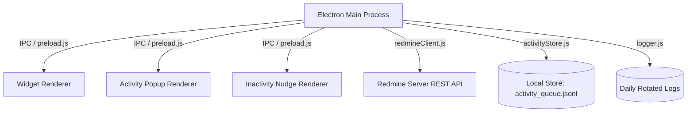
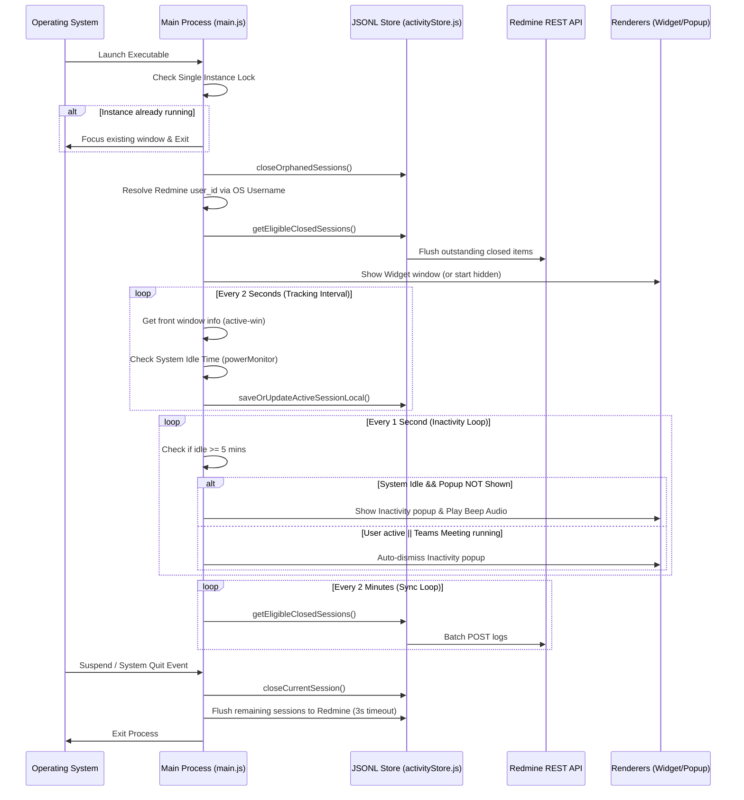

# WorkLens Desktop App | Technical Reference Manual (BRAIN.md)

This document is the single source of truth for the WorkLens Desktop Timelog & Activity Tracking application. It provides a complete conceptual, architectural, and detail-level breakdown of the project to enable any developer or AI assistant to be productive in under 2 minutes.

---

## 1. Project Overview

### Project Name
*   **WorkLens** (formerly *Daily Timelog*)

### Purpose & Problem Solved
WorkLens is a lightweight, system-level desktop productivity widget designed to track active and inactive working time. It automates employee timesheet logging by integrating with a Redmine-based backend, consolidating active window sessions locally, managing system sleep/resume/lock scenarios, and batch-uploading activity logs.
It solves:
1.  **Manual Timesheet Fatigue:** Eliminates the need for employees to track daily work logs manually.
2.  **API Server Overload:** Minimizes network requests on the backend by batching sync intervals (every 2 minutes) and consolidating similar sessions offline rather than sending telemetry every few seconds.
3.  **Inactivity Triggers:** Reminds users to stay focused when inactive via a nudge popup containing motivational quotes.

### Target Users
*   Employees tracking daily effort.
*   Redmine Administrators & Project Managers reviewing activity logs.

### Application Architecture
WorkLens is built on Electron's multi-process architecture. It consists of:
*   **Main Process:** Controls system-level events, active window tracking, idle state monitoring, power hooks (sleep/resume/lock/unlock), automated updates, and a local offline JSONL database.
*   **Renderer Processes:**
    1.  *Main Widget:* A minimalist, frameless desktop status window (185px × 60px) pinned to the bottom-right corner.
    2.  *Activity Detail Popup:* A glassmorphism/Fluent UI container presenting grouped active logs.
    3.  *Inactivity Nudge Card:* A transparent prompt playing audio alerts and displaying motivational quotes when idle time is exceeded.



---

## 2. Tech Stack

| Technology Layer | Solution | Version / Details |
| :--- | :--- | :--- |
| **Core Framework** | Electron | `^42.4.1` (Chromium + Node.js) |
| **Runtime Environment** | Node.js | Native inside Electron package |
| **Active Window Tracking** | `active-win` | `^8.2.1` (polls front window executable names/titles) |
| **Local Cache Store** | JSON Lines File (JSONL) | `activity_queue.jsonl` managed in `%APPDATA%/WorkLens` |
| **API Client** | Native `fetch` wrapper | Standard JS fetch in Node.js (with custom header auth) |
| **Logging Utility** | `electron-log` | `^5.4.4` (7-day rotation, max 10MB per file) |
| **Auto Updates** | `electron-updater` | `^6.8.9` (releases synced via GitHub Provider) |
| **Configuration** | `dotenv` | `^16.4.5` (handles `.env` parsing) |
| **User Interface** | HTML5, CSS3, Vanilla JS | Fluent design elements, system beep audio via Web Audio API |
| **Build/Packaging System** | `electron-builder` | `^26.15.3` (NSIS target for Windows installer production) |

---

## 3. Folder Structure

The repository is structured to separate system-level logic from presentation assets.

```
WorkLens/
├── .agents/                    # Workspace agent customizations
├── assets/                     # Application assets
│   └── icon.png                # Main application icon (128x128px png)
├── dist/                       # Output folder for production builders (ignored)
├── node_modules/               # Dependencies (ignored)
├── renderer/                   # Front-end renderer window files
│   ├── activity-popup.css      # Style details for the glassmorphism activity details popup
│   ├── activity-popup.html     # HTML structure of the activity details popup
│   ├── activity-popup.js       # Reconciler and UI handler for the activity details popup
│   ├── index.html              # Main widget HTML layout
│   ├── renderer.js             # Main widget interface controller (triggers UI sync and event listeners)
│   └── style.css               # Main widget layout styling
├── activityStore.js            # Offline database manager (handles JSONL operations and pruning)
├── CHANGELOG.md                # Evolution log of the desktop app
├── inactivityPopup.html        # Nudge UI & Web Audio beep synthesized tone code
├── logger.js                   # log configurations (resolves and purges logs older than 7 days)
├── main.js                     # Main Electron process driver (lifecycle, window creation, active-win tracking)
├── package.json                # Project configurations, builder targets, dependencies list
├── preload.js                  # IPC context bridge exposing APIs securely to renderer windows
├── quotes.js                   # Local quotes storage array for inactivity nudges
├── redmineClient.js            # Native fetch wrapper for Redmine HTTP REST requests
├── .env                        # Active environment configurations (not committed)
└── .env.example                # Example configuration template for environment setup
```

### Placement Guidelines
*   **Do Place in `renderer/`:** CSS files, scripts, and views that represent UI elements which run within a sandbox environment.
*   **Do Place in Root:** System-level logic modules, configuration structures, IPC interfaces, utility services, and state store files.
*   **Do NOT Place in `renderer/`:** Node modules imports, API clients directly making network requests, or direct filesystem access calls.

---

## 4. Entry Points

WorkLens has structured boundaries where processes start execution:

### 1. Main Process: [main.js](file:///c:/Users/karthikeya.kondavath/Desktop/Daily-Timelog-Main/WorkLens/main.js)
This is the application startup handler. Execution flows as follows:
*   Initializes the environment using `dotenv`.
*   Appends arguments like `--autoplay-policy=no-user-gesture-required` to enable automatic browser beep triggers.
*   Acquires the single-instance lock via `app.requestSingleInstanceLock()`.
*   Sets up system tray hooks and registers background loops:
    *   **Inactivity Check Interval (1 sec):** Closed-loop verification of user idle status.
    *   **Activity Tracking Tick (2 sec):** Queries active window titles and appends/consolidates them.
    *   **Flush Sync Worker (2 min):** Flushes local cache records to the Redmine API.
*   Executes update validations and binds power monitor state listeners (suspend, resume, lock, unlock).

### 2. IPC Context Bridge: [preload.js](file:///c:/Users/karthikeya.kondavath/Desktop/Daily-Timelog-Main/WorkLens/preload.js)
The bridge scripts run before renderer files load. It exposes a restricted `window.api` namespace containing method call mappings. It acts as a security barrier preventing the UI from executing arbitrary Node.js scripts.

### 3. Renderer Scripts
*   **[renderer/renderer.js](file:///c:/Users/karthikeya.kondavath/Desktop/Daily-Timelog-Main/WorkLens/renderer/renderer.js):** Coordinates values displayed by `renderer/index.html`. Handles clicks on the "Active Time" card to trigger details popups.
*   **[renderer/activity-popup.js](file:///c:/Users/karthikeya.kondavath/Desktop/Daily-Timelog-Main/WorkLens/renderer/activity-popup.js):** Runs inside the glassmorphism details window. Polls logging details from the main process and binds CSS layouts.

---

## 5. Application Flow

The lifecycle flow of the application from startup to shutdown is structured as follows:



---

## 6. Feature Documentation

### 1. Frameless Widget Panel
*   **Purpose:** Provide employees with a non-intrusive status interface showing their recorded and logged times.
*   **Files Involved:** 
    *   [renderer/index.html](file:///c:/Users/karthikeya.kondavath/Desktop/Daily-Timelog-Main/WorkLens/renderer/index.html)
    *   [renderer/style.css](file:///c:/Users/karthikeya.kondavath/Desktop/Daily-Timelog-Main/WorkLens/renderer/style.css)
    *   [renderer/renderer.js](file:///c:/Users/karthikeya.kondavath/Desktop/Daily-Timelog-Main/WorkLens/renderer/renderer.js)
*   **UI Metrics Displayed:** 
    *   *Time Logs (Redmine Summary):* Shows yesterday's (Y) and today's (T) logged times returned by Redmine.
    *   *Active Time (Local Tracked Time):* Shows local tracked active time yesterday (Y) and today (T).
    *   *Status Dot:* A pulsing indicator representing "Active" (Green) or "Inactive" (Orange) states.

### 2. Active Window Tracking
*   **Purpose:** Continuously poll the top-most window in the OS to track where the user's attention is focused.
*   **Files Involved:**
    *   [main.js](file:///c:/Users/karthikeya.kondavath/Desktop/Daily-Timelog-Main/WorkLens/main.js) (tracking tick, active-win binding)
*   **Key Logic Rules:**
    *   **Lock Screen Exclusion:** Active tracking is suspended, and the status is set to `Inactive` if `lockapp.exe` (Windows Lock Screen) is detected.
    *   **Teams Call/Meeting Detection:** Forces status to `Active` even if keyboard/mouse activity is idle, provided the active window title matches meeting/call identifiers (e.g., `\bmeeting\b`, `\bcall\b`, `\bpresenting\b`).
    *   **Passive Transfer Detection:** Flags active transfers (WinSCP or downloads matching percentage progress keywords like `\b\d{1,3}%\s+(downloading|uploading|transferring)\b`) as `Inactive` since they are running in the background.
    *   **Title Normalization:** Normalizes volatile percentage titles (e.g., "82% transferring") to static titles (e.g., "Transferring in progress") to prevent polluting the database.

### 3. Session Consolidation & Local Queue
*   **Purpose:** Consolidate active intervals into single rows in the database (up to 1 hour max) to limit server synchronization load.
*   **Files Involved:**
    *   [activityStore.js](file:///c:/Users/karthikeya.kondavath/Desktop/Daily-Timelog-Main/WorkLens/activityStore.js)
*   **Consolidation Criteria:** If app name, window title, activity status, and target tracking day match the current record, update the existing session's end time and duration instead of creating a new row. If any parameter changes, the current session is closed and queued for synchronization.

### 4. Inactivity Nudge
*   **Purpose:** Prompt employees visually and audibly when the workstation registers no keyboard or mouse inputs for more than 5 minutes.
*   **Files Involved:**
    *   [main.js](file:///c:/Users/karthikeya.kondavath/Desktop/Daily-Timelog-Main/WorkLens/main.js)
    *   [quotes.js](file:///c:/Users/karthikeya.kondavath/Desktop/Daily-Timelog-Main/WorkLens/quotes.js)
    *   [inactivityPopup.html](file:///c:/Users/karthikeya.kondavath/Desktop/Daily-Timelog-Main/WorkLens/inactivityPopup.html)
*   **Behavior Details:** Plays a dual-tone beep at 800Hz for 120ms (repeated after a 250ms delay). Auto-closes when user activity is detected, or after a 15-second timeout if no interaction occurs.

### 5. Detailed Activity Log View (with Expandable Activity Details)
*   **Purpose:** Provide users with an interactive, categorized breakdown of their active time per application, with the ability to expand each application row to view individual window/activity titles and durations.
*   **Files Involved:** 
    *   [renderer/activity-popup.html](file:///c:/Users/karthikeya.kondavath/Desktop/Daily-Timelog-Main/WorkLens/renderer/activity-popup.html)
    *   [renderer/activity-popup.css](file:///c:/Users/karthikeya.kondavath/Desktop/Daily-Timelog-Main/WorkLens/renderer/activity-popup.css)
    *   [renderer/activity-popup.js](file:///c:/Users/karthikeya.kondavath/Desktop/Daily-Timelog-Main/WorkLens/renderer/activity-popup.js)
*   **Expansion Mechanics:** 
    *   Visuals: Each application row has a chevron SVG icon on the far left that rotates 90 degrees downward when expanded. Hover highlights, subtle list borders, indent offsets (44px padding-left), and constrained title widths (using `min-width: 0` to prevent layout overflow from long titles pushing duration times off-screen) are applied.
    *   *Behavior:* Clicking anywhere on an application row toggles its expansion state. Only one application group can remain expanded at a time; expanding another collapses the previously active one.
    *   *Animations:* A smooth 250ms CSS Grid transition of `grid-template-rows` from `0fr` to `1fr` is used on the details wrapper to expand/collapse without JS-forced reflows.
    *   *Accessibility:* Full keyboard access is supported via `tabindex="0"`, `role="button"`, dynamic `aria-expanded` status, and Enter/Space key toggling.
    *   *Data:* Aggregates window tracking durations by unique title and sorts child activities descending.
*   **Icon Caching:** Resolves executable file icons on the main thread using standard shell queries (`Get-Process`) and converts them to base64 images to prevent CPU overhead in the rendering process.

---

## 7. API Documentation

All API communications are handled in [redmineClient.js](file:///c:/Users/karthikeya.kondavath/Desktop/Daily-Timelog-Main/WorkLens/redmineClient.js). Requests require the `REDMINE_API_KEY` token, which is passed in the query parameters (`?key=...`) and as the `X-Redmine-API-Key` header.

### 1. User Account Resolution
*   **URL:** `GET /users.json`
*   **Parameters:** `name=<os_username>&limit=100`
*   **Purpose:** Fetch the user object matching the logged-in OS username to retrieve the Redmine user ID.
*   **Response Shape:**
    ```json
    {
      "users": [
        { "id": 42, "login": "karthikeya.k" }
      ]
    }
    ```

### 2. Logged Effort Timesheet
*   **URL:** `GET /today_timesheet.json`
*   **Parameters:** `user_id=<os_username>`
*   **Purpose:** Fetch total working hours logged today and yesterday in Redmine.
*   **Response Shape:**
    ```json
    {
      "user": { "id": 42, "name": "Karthikeya Kondavathri" },
      "yesterday": { "date": "2026-07-26", "hours": "7.5" },
      "today": { "date": "2026-07-27", "hours": "2.0" }
    }
    ```

### 3. Tracked Activity Summary
*   **URL:** `GET /user_system_activity_logs/summary.json`
*   **Parameters:** `user_id=<os_username>`
*   **Purpose:** Retrieve total active duration hours recorded on the server for today and yesterday.
*   **Response Shape:**
    ```json
    {
      "user_id": 42,
      "yesterday": { "date": "2026-07-26", "duration_hours": "6.83" },
      "today": { "date": "2026-07-27", "duration_hours": "1.5" }
    }
    ```

### 4. Today's Activity Details Log
*   **URL:** `GET /user_system_activity_logs/today.json`
*   **Parameters:** `user_id=<user_id>`
*   **Purpose:** Retrieve the full, raw list of activity logs registered today.
*   **Response Shape:**
    ```json
    {
      "entries": [
        {
          "id": 10043,
          "user_id": 42,
          "app_name": "Visual Studio Code",
          "window_title": "main.js - WorkLens",
          "start_time": "2026-07-27T10:00:00",
          "end_time": "2026-07-27T10:45:00",
          "duration": 2700,
          "status": "active"
        }
      ]
    }
    ```

### 5. Submit Session Log
*   **URL:** `POST /user_system_activity_logs.json`
*   **Body Payload:**
    ```json
    {
      "user_id": 42,
      "app_name": "Google Chrome",
      "window_title": "WorkLens - Pull Requests",
      "start_time": "2026-07-27T11:00:00",
      "end_time": "2026-07-27T11:05:00",
      "duration": 300,
      "activity_on": "2026-07-27",
      "status": "active"
    }
    ```
*   **Sync Behavior:** Batched every 2 minutes. Failed logs are retried with an exponential backoff delay.

---

## 8. Database Documentation

WorkLens uses a lightweight offline store implemented as a JSON Lines (JSONL) file rather than a heavy SQLite database engine.

*   **File Path:** `%APPDATA%/WorkLens/activity_queue.jsonl` (Resolved dynamically via `app.getPath('userData')`).
*   **Format:** Each line is a valid JSON string representing an activity log entry.

### Schema Properties

| Field Name | Type | Description |
| :--- | :--- | :--- |
| `local_id` | String | Unique UUID generated on the client. |
| `user_id` | Integer / Null | The resolved Redmine User ID. |
| `app_name` | String | Tracked executable application name (e.g., `chrome.exe`). |
| `window_title` | String | Window header title at the time of tracking. |
| `start_time` | String (ISO) | ISO start timestamp formatted in local system time. |
| `end_time` | String (ISO) | ISO end timestamp formatted in local system time. |
| `duration` | Integer | Total elapsed active time in seconds. |
| `activity_on` | String | Calendar log target date (`YYYY-MM-DD`). |
| `status` | String | Status flags (`active` or `inactive`). |
| `closed` | Boolean | True if the session has ended and is ready to sync. |
| `synced` | Boolean | True if the record has been uploaded to the Redmine API. |
| `retry_count` | Integer | Number of failed upload attempts. |
| `last_error` | String / Null | Error message from the last failed sync attempt. |
| `created_at` | String (ISO) | Local record creation timestamp. |
| `updated_at` | String (ISO) | Local record modification timestamp. |

### Data Pruning & Optimization
To keep the storage size optimized, the write routine in [activityStore.js](file:///c:/Users/karthikeya.kondavath/Desktop/Daily-Timelog-Main/WorkLens/activityStore.js#L71-L93) automatically prunes synced records that are older than 1 day from the `activity_queue.jsonl` file.

---

## 9. State Management

WorkLens manages application state across memory and local storage:

```
┌────────────────────────────────────────────────────────┐
│                      MEMORY STATE                      │
│                                                        │
│  currentRecord: Current active tracking session block   │
│  cachedUserId: Resolved numeric Redmine user ID        │
│  appIconCache: Base64 icons mapped by app name         │
│  cachedActiveTimeToday/Yesterday: Tracker cache        │
│  activitySummaryCache: 5s API responses cache          │
└──────────┬──────────────────────────────────▲──────────┘
           │ Writes                           │ Reads
           ▼                                  │
┌─────────────────────────────────────────────┴──────────┐
│                   PERSISTENT STORAGE                   │
│                                                        │
│  activity_queue.jsonl: Unsynced & recently synced logs │
│  logger.js (Logs folder): Local troubleshooting logs   │
└────────────────────────────────────────────────────────┘
```

*   **Temporary Memory Buffers:** Keeps current trackers and user sessions in memory for fast performance.
*   **Summary Caching:** Caches activity summaries for 5 seconds to prevent concurrent requests to the Redmine API when updating the widget.

---

## 10. IPC & Event Flow

Preload bridges access paths by mapping handlers across processes:

| IPC Channel | Direction | Payload | Purpose |
| :--- | :--- | :--- | :--- |
| `get-username` | Invoked by UI | None | Returns `{ username: string, error: string|null }` containing OS username and Redmine connection error details. |
| `get-employee-id` | Invoked by UI | None | Returns numeric Redmine ID. |
| `get-app-version` | Invoked by UI | None | Returns active semantic version string. |
| `get-redmine-efforts` | Invoked by UI | None | Returns today's and yesterday's logged times. |
| `get-active-time-today` | Invoked by UI | None | Returns total local tracked seconds today (including unsynced). |
| `get-active-time-yesterday` | Invoked by UI | None | Returns total local tracked seconds yesterday. |
| `get-current-status` | Invoked by UI | None | Returns active state (`Active`/`Inactive`). |
| `toggle-activity-popup` | Invoked by UI | None | Shows/hides the activity log details window. |
| `open-activity-popup` | Invoked by UI | None | Positions and displays the activity popup. |
| `close-activity-popup` | Invoked by UI | None | Closes/hides the activity popup. |
| `close-inactivity-popup`| Invoked by UI | None | Closes/destroys the inactivity nudge window. |
| `fetch-activity-logs` | Invoked by UI | None | Returns sorted today logs + icon base64 mappings. |
| `popup-ready` | Invoked by UI | None | Signals main process that the details window is ready. |
| `trigger-sync` | Invoked by UI | None | Explicitly triggers an offline-queue sync. |
| `popup-status-changed` | Sent by Main | Status string (`opened`/`closed`) | Controls background polling loops. |
| `update-arrow-position` | Sent by Main | `arrowLeft` (int), `isBelow` (bool) | Updates pointer layout on details popup. |
| `request-close` | Sent by Main | None | Triggers close transitions inside UI windows. |

---

## 11. Background Jobs

WorkLens runs several key background processes:

### 1. Activity Monitoring Tick
*   **Interval:** Every 2 seconds.
*   **Logic:** Polls `active-win` and `powerMonitor.getSystemIdleTime()`. Updates the current in-memory record and persists updates to the local JSONL queue.

### 2. Inactivity Monitor Loop
*   **Interval:** Every 1 second.
*   **Logic:** Monitors system idle time. Shows the inactivity nudge window if idle time exceeds 5 minutes (`INACTIVITY_THRESHOLD_SECONDS = 300`).

### 3. Sync Flush Task
*   **Interval:** Every 2 minutes.
*   **Logic:** Uploads closed, unsynced sessions from the queue to Redmine.
*   **Retry Handling:** Implements exponential backoff (`2^(retry_count - 1)` minutes, up to a maximum of 60 minutes) for failed logs.

### 4. Auto Update Checker
*   **Interval:** On startup, and repeated every 4 hours.
*   **Logic:** Calls GitHub release endpoints to download and install updates.

### 5. Startup Cleanup Tasks
*   Closes orphaned sessions (where `closed: false` from a previous session).
*   Prunes log files older than 7 days from the logs folder.

---

## 12. Configuration & Environment

Configuration parameters are loaded from the environment:

*   **`REDMINE_BASE_URL`:** The endpoint domain hosting the target timesheet interface.
*   **`REDMINE_API_KEY`:** Access token permissions associated with client write actions.
*   **`app.isPackaged` Resolution:** In development, config parameters are loaded from the project root directory. In production, they are loaded from `.env` in the packaged resources directory (`process.resourcesPath`).

### Hardcoded Configuration Constants

```javascript
const INACTIVITY_THRESHOLD_SECONDS = 300; // 5 mins idle limit
const IDLE_CHECK_INTERVAL_MS = 1000;       // 1s idle status verification
const POPUP_AUTO_CLOSE_MS = 15000;         // 15s nudge auto-close timeout
```

---

## 13. External Integrations

### Redmine Server
*   **Authentication:** API token auth via the `X-Redmine-API-Key` header and the `?key=` query parameter.
*   **Payload Types:** JSON payload formatting is used for all transactions.

### GitHub Releases
*   **Target Integration:** Automated updates using `electron-updater`.
*   **Repository Configuration:** Configured in `package.json`:
    ```json
    "publish": {
      "provider": "github",
      "owner": "karthikeyaabm",
      "repo": "worklens",
      "releaseType": "release"
    }
    ```

---

## 14. Build & Release Process

WorkLens uses `electron-builder` to package the application.

```bash
# 1. Run widget in development mode
npm start

# 2. Package installer files for Windows (.exe installer via NSIS)
npm run build

# 3. Publish builds to GitHub Releases (runs updater pipelines)
npm run release
```

### Packaging Details
*   **Application ID:** `com.worklens.desktop`
*   **Resources Packaging:** The `.env` configuration file is included in the application bundle using the `extraResources` copy filter.

---

## 15. Coding Standards

*   **Separation of Concerns:** Keep OS API calls, window states, and process logic in the Main Process. Renderer files should focus on UI rendering and styles.
*   **Secure Preload Exposure:** Do not expose Node's `require` or native bindings to the renderer. Use the context bridge to define APIs.
*   **Robust Error Handling:** Wrap all API requests and window tracking calls in `try-catch` blocks to prevent crashes on network failures or application switches.
*   **User Path Safety:** Use `app.getPath('userData')` to resolve file paths. Do not use hardcoded root folders.
*   **Time Tracking Units:** Use seconds for logs in the database. Convert these to decimal hours (e.g., `1.5h`) when displaying them in the UI.

---

## 16. Known Issues & Limitations

1.  **Browser Title Overloads:** Tracking browser windows can create multiple short log entries when switching tabs rapidly. (Mitigated by the 2-minute sync interval and session consolidation rules).
2.  **OS Support:** Platform-specific window titles (such as the Windows lock screen `lockapp.exe`) must be configured manually for other operating systems.
3.  **Active Teams Override:** System idle checks are bypassed during active Teams calls, which relies on the window title containing meeting-related words.

---

## 17. TODO Roadmap

*   [ ] **Ignore List UI:** Allow users to filter out specific processes (such as games or system apps) from being tracked.
*   [ ] **Category Mapping:** Automatically group application logs into categories like "Development", "Meetings", or "System Admin".
*   [ ] **Manual Log Correction:** Allow users to correct or manually adjust recorded time logs before they sync to Redmine.
*   [ ] **Cross-Platform Support:** Extend window tracking and system idle detection to macOS and Linux.

---

## 18. Important Business Logic

### Session Consolidation Algorithm
*   Calculates active intervals by comparing process parameters every 2 seconds.
*   If `appName`, `windowTitle`, `status`, and `day` match the current record, the active session is updated.
*   If the app changes, the system locks, or a new day begins, the current session is closed and written to the JSONL queue.

### Active/Inactive State Resolution

```
                  ┌──────────────────────────┐
                  │   Is Workstation Locked  │
                  │   (e.g., lockapp.exe)?   │
                  └────────────┬─────────────┘
                               │
                      Yes ┌────┴────┐ No
            ┌─────────────┴─┐     ┌─┴────────────────────────┐
            │ Flag INACTIVE │     │ Is System Idle >= 5m     │
            └───────────────┘     │ (Keyboard/Mouse Inactive)│
                                  └──────────┬───────────────┘
                                             │
                                    Yes ┌────┴────┐ No
                          ┌─────────────┴─┐     ┌─┴────────────────────────┐
                          │ Is Active MS  │     │ Is Volatile Transfer     │
                          │ Teams Call?   │     │ (WinSCP / Download)?     │
                          └──────┬────────┘     └──────────┬───────────────┘
                                 │                         │
                        Yes ┌────┴────┐ No        Yes ┌────┴────┐ No
                  ┌─────────┴─┐   ┌───┴─────┐   ┌─────┴─────┐   ┌───┴─────┐
                  │Flag ACTIVE│   │  Flag   │   │   Flag    │   │  Flag   │
                  └───────────┘   │INACTIVE │   │ INACTIVE  │   │ ACTIVE  │
                                  └─────────┘   └───────────┘   └─────────┘
```

---

## 19. Security Notes

*   **API Credentials:** Keep the `REDMINE_API_KEY` token secure in the `.env` file. Do not commit `.env` files to git.
*   **Execution Sandbox:** Keep `nodeIntegration` disabled and `contextIsolation` enabled in all BrowserWindow instances to prevent unauthorized shell access.

---

## 20. Performance Notes

*   **Request De-duplication:** Employs an in-flight promise lock (`activitySummaryInFlight`) in [main.js](file:///c:/Users/karthikeya.kondavath/Desktop/Daily-Timelog-Main/WorkLens/main.js#L830) to prevent parallel requests from overwhelming the server when renderers load.
*   **Process Icon Caching:** Base64 icons are cached in memory to reduce shell execution overhead when resolving application icons.
*   **Pruning Synced Logs:** Prunes synced logs older than 1 day from the JSONL queue on every write to maintain a small database size.

---

## 21. Testing

### Manual Testing
1.  **Network Offline Test:** Disconnect from the network, run the app, and verify that activity logs are saved to the JSONL file. Reconnect to the network and verify that logs are successfully synced.
2.  **Inactivity Verification:** Leave the workstation idle for 5 minutes and verify that the inactivity nudge popup appears with an audio beep. Move the mouse and verify that the popup auto-dismisses.
3.  **App Switcher Test:** Open multiple apps (e.g., VS Code, Chrome, Terminal) and verify that the activity breakdown popup displays the active time distribution correctly.

---

## 22. Debugging Guide

*   **Main Process Logs:** Located in `%APPDATA%/WorkLens/logs/worklens-YYYY-MM-DD.log`.
*   **Renderer DevTools:** To debug the UI, temporarily enable DevTools in `main.js`:
    ```javascript
    mainWindow.webContents.openDevTools();
    ```

---

## 23. Dependency Map

```
  ┌────────────────────────────────────────────────────────┐
  │                        main.js                         │
  └────┬──────────────┬──────────────┬──────────────┬──────┘
       │              │              │              │
       ▼              ▼              ▼              ▼
┌────────────┐ ┌────────────┐ ┌────────────┐ ┌────────────┐
│ preload.js │ │logger.js   │ │activity-   │ │redmine-    │
│            │ │            │ │Store.js    │ │Client.js   │
└──────┬─────┘ └────────────┘ └────────────┘ └────────────┘
       │
       ▼
┌────────────┐
│ renderers  │
└────────────┘
```

---

## 24. AI Development Rules

When adding features or modifying code in WorkLens, AI assistants must adhere to the following rules:

### 1. Code Style Guidelines
*   Write modular CommonJS code in the main process and modern ES modules in the renderer.
*   Keep helper utilities focused and reusable.
*   Ensure all API requests have timeout handling.

### 2. Forbidden Modifications
*   **Do NOT expose native Node APIs directly to the renderer.** Always route communication through the context bridge in `preload.js`.
*   **Do NOT remove file-archival or pruning routines.** Database and log files must be kept small.

### 3. Review Checklist for Changes
- [ ] Verify that UI changes work on Windows 11 and match the Fluent/glassmorphism design guidelines.
- [ ] Confirm that all database operations in `activityStore.js` run asynchronously and do not block the main process thread.
- [ ] Check that new API endpoints have proper error handling and fallback values.

---

## 25. Change Log Summary

*   **v1.0.1 - Initial Version:** Frameless widget layout with active window tracking.
*   **v1.0.7 - System Tray:** Runs in the system tray with single-instance locking.
*   **v1.0.8 - Fluent Popup:** Detailed activity log breakdown popup with base64 icon caching.
*   **v1.0.9 - Inactivity Nudge:** Visual popups with audio alerts for idle sessions.
*   **v1.1.0 - Offline Sync:** JSONL-based local storage queue with automatic retry handling and session consolidation.
*   **v1.1.1 - Expandable Activity Details:** Added chevrons and interactive expansion dropdowns in the Active Time details popup to view specific window titles and durations with smooth CSS Grid animations and keyboard accessibility.

---

## 26. Glossary

*   **Active Time:** Duration in seconds where the user is active on the workstation.
*   **Inactivity Nudge:** Visual and audio alert triggered when the system is idle for 5 minutes.
*   **JSONL (JSON Lines):** A text-based format where each line is a valid JSON object.
*   **Redmine Client:** Native client wrapper that handles authentication and API calls to the Redmine server.
*   **Widget:** Minimalist frameless window pinned to the bottom-right corner of the screen.

---

## 27. Quick Start For AI

```
1. Set up connection parameters in the .env file.
2. Run "npm install" to install dependencies.
3. Run "npm start" to launch the widget in development.
4. Main Process Entry Point: main.js
5. Database operations & queue: activityStore.js
6. API Request Client: redmineClient.js
7. UI Views: renderer/index.html & renderer/activity-popup.html
```

---

## 28. Update Instructions

> [!IMPORTANT]
> Whenever code changes, this `BRAIN.md` must also be updated.
> If any feature is modified, renamed, removed, or added, update the relevant section immediately. Never leave outdated documentation.
