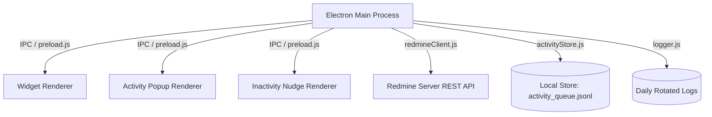
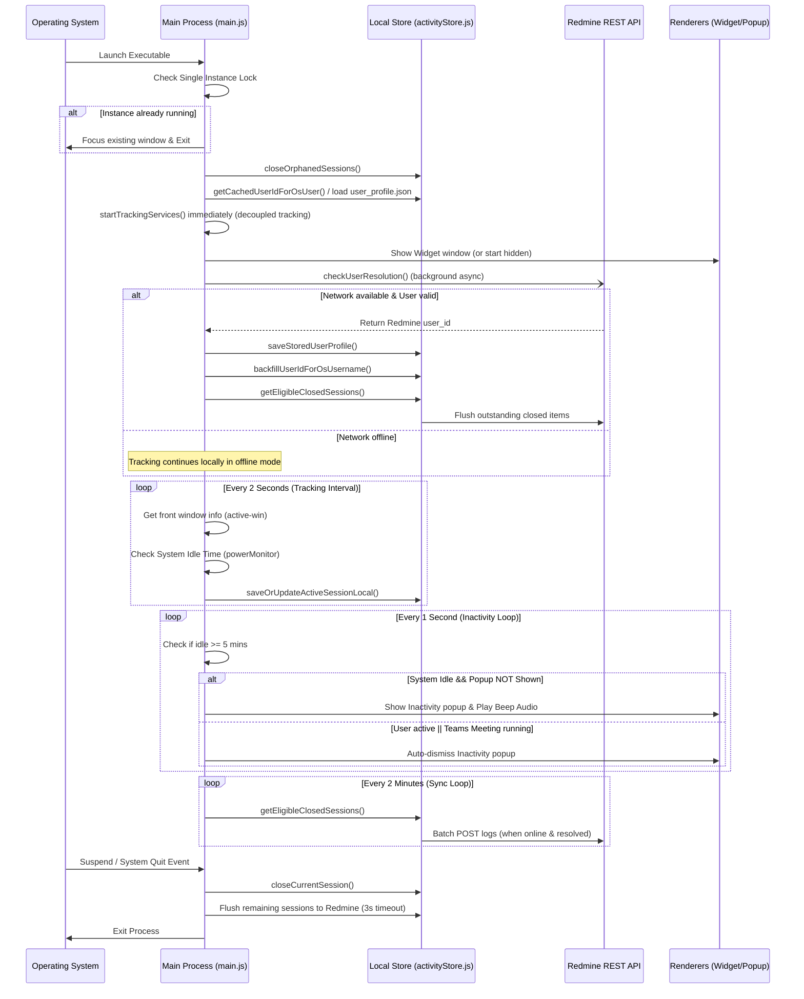

# WorkLens Desktop App | Technical Reference Manual (BRAIN.md)

This document is the single source of truth for the WorkLens Desktop Timelog & Activity Tracking application. It provides a complete conceptual, architectural, and detail-level breakdown of the project to enable any developer or AI assistant to be productive in under 2 minutes.

---

## 1. Project Overview

### Project Name
*   **WorkLens** (formerly *Daily Timelog*)

### Purpose & Problem Solved
WorkLens is a lightweight, system-level desktop productivity widget designed to track active and inactive working time. It automates employee timesheet logging by integrating with a Redmine-based backend, consolidating active window sessions locally, managing system sleep/resume/lock scenarios, and batch-uploading activity logs.
It solves:
1.  **Manual Timesheet Fatigue:** Eliminates the need for employees to track daily work logs manually.
2.  **API Server Overload:** Minimizes network requests on the backend by batching sync intervals (every 2 minutes) and consolidating similar sessions offline rather than sending telemetry every few seconds.
3.  **Inactivity Triggers:** Reminds users to stay focused when inactive via a nudge popup containing motivational quotes.

### Target Users
*   Employees tracking daily effort.
*   Redmine Administrators & Project Managers reviewing activity logs.

### Application Architecture
WorkLens is built on Electron's multi-process architecture. It consists of:
*   **Main Process:** Controls system-level events, active window tracking, idle state monitoring, power hooks (sleep/resume/lock/unlock), automated updates, and a local offline JSONL database.
*   **Renderer Processes:**
    1.  *Main Widget:* A minimalist, frameless desktop status window (185px × 60px) pinned to the bottom-right corner.
    2.  *Activity Detail Popup:* A glassmorphism/Fluent UI container presenting grouped active logs.
    3.  *Inactivity Nudge Card:* A transparent prompt playing audio alerts and displaying motivational quotes when idle time is exceeded.


```mermaid
graph TD
    A[Electron Main Process] -->|IPC / preload.js| B[Widget Renderer]
    A -->|IPC / preload.js| C[Activity Popup Renderer]
    A -->|IPC / preload.js| D[Inactivity Nudge Renderer]
    A -->|redmineClient.js| E[Redmine Server REST API]
    A -->|activityStore.js| F[(Local Store: activity_queue.jsonl)]
    A -->|logger.js| G[(Daily Rotated Logs)]
```

---

## 2. Tech Stack

| Technology Layer | Solution | Version / Details |
| :--- | :--- | :--- |
| **Core Framework** | Electron | `^42.4.1` (Chromium + Node.js) |
| **Runtime Environment** | Node.js | Native inside Electron package |
| **Active Window Tracking** | `active-win` | `^8.2.1` (polls front window executable names/titles) |
| **Global Input Hook** | `uiohook-napi` | `^1.5.5` (global keyboard and mouse event listener) |
| **Local Cache Store** | JSON Lines File (JSONL) | `activity_queue.jsonl` managed in `%APPDATA%/WorkLens` |
| **API Client** | Native `fetch` wrapper | Standard JS fetch in Node.js (with custom header auth) |
| **Logging Utility** | `electron-log` | `^5.4.4` (7-day rotation, max 10MB per file) |
| **Auto Updates** | `electron-updater` | `^6.8.9` (releases synced via GitHub Provider) |
| **Configuration** | `dotenv` | `^16.4.5` (handles `.env` parsing) |
| **User Interface** | HTML5, CSS3, Vanilla JS | Fluent design elements, system beep audio via Web Audio API |
| **Build/Packaging System** | `electron-builder` | `^26.15.3` (NSIS target for Windows installer production) |

---

## 3. Folder Structure

The repository is structured to separate system-level logic from presentation assets.

```
WorkLens/
├── .agents/                    # Workspace agent customizations
├── assets/                     # Application assets
│   └── icon.png                # Main application icon (128x128px png)
├── dist/                       # Output folder for production builders (ignored)
├── node_modules/               # Dependencies (ignored)
├── renderer/                   # Front-end renderer window files
│   ├── activity-popup.css      # Style details for the glassmorphism activity details popup
│   ├── activity-popup.html     # HTML structure of the activity details popup
│   ├── activity-popup.js       # Reconciler and UI handler for the activity details popup
│   ├── index.html              # Main widget HTML layout
│   ├── renderer.js             # Main widget interface controller (triggers UI sync and event listeners)
│   └── style.css               # Main widget layout styling
├── anti-afk/                   # Modular Behavior Analysis Engine
│   ├── config.js               # Thresholds, weights, and decision levels
│   ├── eventQueue.js           # Rolling in-memory event buffer
│   ├── eventCollector.js       # Event collection and formatting
│   ├── keyboardFeatures.js     # Keyboard metrics extraction
│   ├── mouseFeatures.js        # Mouse metrics (distance, speed, curvature, clicks)
│   ├── windowFeatures.js       # Window focus metrics (switches, stays, ping-pong)
│   ├── idleFeatures.js         # Idle status and wake-up patterns
│   ├── featureExtractor.js     # Primary feature extraction interface
│   ├── behaviorAnalyzer.js     # Indicators for suspicious behaviors
│   ├── scoreEngine.js          # Confidence scoring and developer overrides
│   ├── decisionEngine.js       # Classification (Human, Watch, Suspicious, Likely Automation)
│   └── antiAfkDetector.js      # Primary orchestrator and API endpoints
├── watchdog/                   # Watchdog & Auto-Recovery Subsystem
│   ├── worklens-watchdog.ps1   # Primary Windows PowerShell background watchdog monitor
│   ├── worklens-watchdog.vbs   # Zero-console stealth launcher for Windows startup
│   └── watchdog.js             # Node.js supervisor engine for dev/cross-platform supervision
├── activityStore.js            # Offline database manager (handles JSONL operations, pruning, and atomic writes)
├── antiAfkDetector.js          # Backward compatibility wrapper for the anti-AFK engine
├── CHANGELOG.md                # Evolution log of the desktop app
├── inactivityPopup.html        # Nudge UI & Web Audio beep synthesized tone code
├── logger.js                   # log configurations (resolves and purges logs older than 7 days)
├── main.js                     # Main Electron process driver (lifecycle, window creation, active-win tracking)
├── package.json                # Project configurations, builder targets, dependencies list
├── preload.js                  # IPC context bridge exposing APIs securely to renderer windows
├── quotes.js                   # Local quotes storage array for inactivity nudges
├── redmineClient.js            # Native fetch wrapper for Redmine HTTP REST requests
├── storageHealth.js            # Local persistence supervisor (ENOSPC detection, failure threshold, cooldown, notifications)
├── .env                        # Active environment configurations (not committed)
└── .env.example                # Example configuration template for environment setup
```

### Placement Guidelines
*   **Do Place in `renderer/`:** CSS files, scripts, and views that represent UI elements which run within a sandbox environment.
*   **Do Place in Root:** System-level logic modules, configuration structures, IPC interfaces, utility services, and state store files.
*   **Do NOT Place in `renderer/`:** Node modules imports, API clients directly making network requests, or direct filesystem access calls.

---

## 4. Entry Points

WorkLens has structured boundaries where processes start execution:

### 1. Main Process: [main.js](file:///c:/Users/karthikeya.kondavath/Desktop/Daily-Timelog-Main/WorkLens/main.js)
This is the application startup handler. Execution flows as follows:
*   Initializes the environment using `dotenv`.
*   Appends arguments like `--autoplay-policy=no-user-gesture-required` to enable automatic browser beep triggers.
*   Acquires the single-instance lock via `app.requestSingleInstanceLock()`.
*   Ensures the independent Watchdog supervisor is running and registered in Windows Startup.
*   Detects `--recovered` argument to display the recovery notification if automatically restarted.
*   Sets up system tray hooks and registers background loops:
    *   **Inactivity Check Interval (1 sec):** Closed-loop verification of user idle status.
    *   **Activity Tracking Tick (2 sec):** Queries active window titles and appends/consolidates them with clock skew / time jump protection.
    *   **Flush Sync Worker (2 min):** Flushes local cache records to the Redmine API with duration and date sanity filtering.
*   Executes update validations and binds power monitor and system lifecycle state listeners (suspend, resume, shutdown, session-end, lock, unlock).

### 2. Watchdog Supervisor: [watchdog/worklens-watchdog.ps1](file:///c:/Users/karthikeya.kondavath/Desktop/Daily-Timelog-Main/WorkLens/watchdog/worklens-watchdog.ps1) & [watchdog/worklens-watchdog.vbs](file:///c:/Users/karthikeya.kondavath/Desktop/Daily-Timelog-Main/WorkLens/watchdog/worklens-watchdog.vbs)
Independent background process monitoring WorkLens health:
*   Runs separately from `WorkLens.exe` (immune to Task Manager "End Task" on WorkLens).
*   Polls process health every 3 seconds.
*   Enforces 5-second grace period before recovery restart.
*   Implements restart-loop protection (maximum 3 restarts within a sliding 5-minute window).
*   Reads `%APPDATA%/WorkLens/watchdog-state.json` to avoid restarting during intentional system shutdowns, logoffs, or auto-updates.

### 3. IPC Context Bridge: [preload.js](file:///c:/Users/karthikeya.kondavath/Desktop/Daily-Timelog-Main/WorkLens/preload.js)
The bridge scripts run before renderer files load. It exposes a restricted `window.api` namespace containing method call mappings. It acts as a security barrier preventing the UI from executing arbitrary Node.js scripts.

### 4. Renderer Scripts
*   **[renderer/renderer.js](file:///c:/Users/karthikeya.kondavath/Desktop/Daily-Timelog-Main/WorkLens/renderer/renderer.js):** Coordinates values displayed by `renderer/index.html`. Handles clicks on the "Active Time" card to trigger details popups.
*   **[renderer/activity-popup.js](file:///c:/Users/karthikeya.kondavath/Desktop/Daily-Timelog-Main/WorkLens/renderer/activity-popup.js):** Runs inside the glassmorphism details window. Polls logging details from the main process and binds CSS layouts.

---

## 5. Application Flow

The lifecycle flow of the application from startup to shutdown is structured as follows:


```mermaid
sequenceDiagram
    participant OS as Operating System
    participant Main as Main Process (main.js)
    participant Store as Local Store (activityStore.js)
    participant API as Redmine REST API
    participant UI as Renderers (Widget/Popup)

    OS->>Main: Launch Executable
    Main->>Main: Check Single Instance Lock
    alt Instance already running
        Main->>OS: Focus existing window & Exit
    end
    Main->>Store: closeOrphanedSessions()
    Main->>Store: getCachedUserIdForOsUser() / load user_profile.json
    Main->>Main: startTrackingServices() immediately (decoupled tracking)
    Main->>UI: Show Widget window (or start hidden)
    Main-)API: checkUserResolution() (background async)
    alt Network available & User valid
        API-->>Main: Return Redmine user_id
        Main->>Store: saveStoredUserProfile()
        Main->>Store: backfillUserIdForOsUsername()
        Main->>Store: getEligibleClosedSessions()
        Store->>API: Flush outstanding closed items
    else Network offline
        Note over Main: Tracking continues locally in offline mode
    end
    
    loop Every 2 Seconds (Tracking Interval)
        Main->>Main: Get front window info (active-win)
        Main->>Main: Check System Idle Time (powerMonitor)
        Main->>Store: saveOrUpdateActiveSessionLocal()
    end

    loop Every 1 Second (Inactivity Loop)
        Main->>Main: Check if idle >= 5 mins
        alt System Idle && Popup NOT Shown
            Main->>UI: Show Inactivity popup & Play Beep Audio
        else User active || Teams Meeting running
            Main->>UI: Auto-dismiss Inactivity popup
        end
    end

    loop Every 2 Minutes (Sync Loop)
        Main->>Store: getEligibleClosedSessions()
        Store->>API: Batch POST logs (when online & resolved)
    end

    OS->>Main: Suspend / System Quit Event
    Main->>Store: closeCurrentSession()
    Main->>Store: Flush remaining sessions to Redmine (3s timeout)
    Main->>OS: Exit Process
```

---

## 6. Feature Documentation

### 1. Frameless Widget Panel
*   **Purpose:** Provide employees with a non-intrusive status interface showing their recorded and logged times.
*   **Files Involved:** 
    *   [renderer/index.html](file:///c:/Users/karthikeya.kondavath/Desktop/Daily-Timelog-Main/WorkLens/renderer/index.html)
    *   [renderer/style.css](file:///c:/Users/karthikeya.kondavath/Desktop/Daily-Timelog-Main/WorkLens/renderer/style.css)
    *   [renderer/renderer.js](file:///c:/Users/karthikeya.kondavath/Desktop/Daily-Timelog-Main/WorkLens/renderer/renderer.js)
*   **UI Metrics Displayed:** 
    *   *Time Logs (Redmine Summary):* Shows yesterday's (Y) and today's (T) logged times returned by Redmine.
    *   *Active Time (Local Tracked Time):* Shows local tracked active time yesterday (Y) and today (T).
    *   *Status Dot:* A pulsing indicator representing "Active (Online)" (Green), "Active (Offline)" (Blue), or "Inactive" (Orange) states.
    *   *Close Button:* A Fluent-style close button (`widget-close-btn`) next to the date display. Clicking it gracefully hides the main widget and detail popup to run in the background (restorable via the system tray).

### 2. Active Window Tracking
*   **Purpose:** Continuously poll the top-most window in the OS to track where the user's attention is focused.
*   **Files Involved:**
    *   [main.js](file:///c:/Users/karthikeya.kondavath/Desktop/Daily-Timelog-Main/WorkLens/main.js) (tracking tick, active-win binding)
*   **Key Logic Rules:**
    *   **Lock Screen Exclusion:** Active tracking is suspended, and the status is set to `Inactive` if `lockapp.exe` (Windows Lock Screen) is detected.
    *   **Teams Call/Meeting Detection:** Forces status to `Active` even if keyboard/mouse activity is idle, provided the active window title matches meeting/call identifiers (e.g., `\bmeeting\b`, `\bcall\b`, `\bpresenting\b`).
    *   **Passive Transfer Detection:** Flags active transfers (WinSCP or downloads matching percentage progress keywords like `\b\d{1,3}%\s+(downloading|uploading|transferring)\b`) as `Inactive` since they are running in the background.
    *   **Title Normalization:** Normalizes volatile percentage titles (e.g., "82% transferring") to static titles (e.g., "Transferring in progress") to prevent polluting the database.

### 3. Session Consolidation & Local Queue
*   **Purpose:** Consolidate active intervals into single rows in the database (up to 1 hour max) to limit server synchronization load.
*   **Files Involved:**
    *   [activityStore.js](file:///c:/Users/karthikeya.kondavath/Desktop/Daily-Timelog-Main/WorkLens/activityStore.js)
*   **Consolidation Criteria:** If app name, window title, activity status, and target tracking day match the current record, update the existing session's end time and duration instead of creating a new row. If any parameter changes, the current session is closed and queued for synchronization.

### 4. Inactivity Nudge
*   **Purpose:** Prompt employees visually and audibly when the workstation registers no keyboard or mouse inputs for more than 5 minutes.
*   **Files Involved:**
    *   [main.js](file:///c:/Users/karthikeya.kondavath/Desktop/Daily-Timelog-Main/WorkLens/main.js)
    *   [quotes.js](file:///c:/Users/karthikeya.kondavath/Desktop/Daily-Timelog-Main/WorkLens/quotes.js)
    *   [inactivityPopup.html](file:///c:/Users/karthikeya.kondavath/Desktop/Daily-Timelog-Main/WorkLens/inactivityPopup.html)
*   **Behavior Details:** Plays a dual-tone beep at 800Hz for 120ms (repeated after a 250ms delay). Auto-closes when user activity is detected, or after a 15-second timeout if no interaction occurs.

### 5. Detailed Activity Log View (with Date-Range Selector & Progressive Loading)
*   **Purpose:** Provide users with an interactive, categorized breakdown of their active time per application with historical navigation (Today, Yesterday, Last 7 Days, Last 30 Days) and ultra-fast UI rendering via progressive background loading.
*   **Files Involved:** 
    *   [renderer/activity-popup.html](file:///c:/Users/karthikeya.kondavath/Desktop/Daily-Timelog-Main/WorkLens/renderer/activity-popup.html)
    *   [renderer/activity-popup.css](file:///c:/Users/karthikeya.kondavath/Desktop/Daily-Timelog-Main/WorkLens/renderer/activity-popup.css)
    *   [renderer/activity-popup.js](file:///c:/Users/karthikeya.kondavath/Desktop/Daily-Timelog-Main/WorkLens/renderer/activity-popup.js)
    *   [preload.js](file:///c:/Users/karthikeya.kondavath/Desktop/Daily-Timelog-Main/WorkLens/preload.js) (`onHistoricalDataReady` bridge)
    *   [main.js](file:///c:/Users/karthikeya.kondavath/Desktop/Daily-Timelog-Main/WorkLens/main.js) (`loadHistoricalDataInBackground`, `processHistorical30DaysData`)
*   **Progressive Loading & Fast Response Architecture:**
    *   **Today First Priority (< 20ms):** When the user opens the Active Time popup, Today data is fetched immediately from local queue storage (`getAllTodayLogs()`) and rendered instantly without waiting for the 30-day API call or network roundtrip.
    *   **Background Historical Loader:** The 30-day API (`/user_system_activity_logs/today.json?user_id=<id>`) is fired asynchronously in the background (`loadHistoricalDataInBackground()`) with an extended 90-second timeout to safely receive large datasets (14,000+ entries) without blocking the popup thread or renderer.
    *   **Single-Pass Precomputation (~8ms):** When the 14,000+ API entries arrive, `processHistorical30DaysData()` executes a single $O(N)$ pass that simultaneously categorizes Today, Yesterday, Last 7 Days, and Last 30 Days into `precomputedHistoricalCache` (60s TTL).
    *   **Instant Tab Switching (0ms):** The renderer stores rendered data in `clientViewCache`. Once historical data is ready, switching between Today, Yesterday, Last 7 Days, and Last 30 Days is instantaneous without any redundant API calls or recalculations. Scroll positions are automatically reset to top (`scrollTop = 0`) to show newest dates first.
    *   **Localized Loading State:** If the user clicks Yesterday, Last 7 Days, or Last 30 Days before background loading finishes, a localized non-blocking spinner (`<p id="loading-text">Loading historical data...</p>`) is shown only inside the list container while the popup header, tabs, and Today view remain fully interactive.
    *   **Event Signal & Cache Refresh (`historical-data-ready`):** When background processing finishes, the main process notifies the renderer. The renderer clears stale client historical caches and re-renders the active historical tab immediately with server-verified data.
*   **Expansion Mechanics:** 
    *   Visuals: Each application row has a chevron SVG icon on the far left that rotates 90 degrees downward when expanded. Hover highlights, subtle list borders, indent offsets (44px padding-left), and constrained title widths (using `min-width: 0` to prevent layout overflow from long titles pushing duration times off-screen) are applied.
    *   *Behavior:* Clicking anywhere on an application row toggles its expansion state. Only one application group can remain expanded at a time; expanding another collapses the previously active one.
    *   *Animations:* A smooth 250ms CSS Grid transition of `grid-template-rows` from `0fr` to `1fr` is used on the details wrapper to expand/collapse without JS-forced reflows.
    *   *Accessibility:* Full keyboard access is supported via `tabindex="0"`, `role="button"`, dynamic `aria-expanded` status, and Enter/Space key toggling.
    *   *Data:* Aggregates window tracking durations by unique title and sorts child activities descending.
*   **Session Start & End Time Boundaries:**
    *   **Today Tab:** Subtitle displays the earliest tracking start time for today and dynamically shows `Present` while WorkLens is actively tracking (`trackingInterval !== null`), e.g., `07 Oct 2026     09:32 AM → Present`. If tracking is inactive or stopped, it displays the latest valid session end time.
    *   **Yesterday Tab:** Subtitle displays the actual isolated tracking period between the earliest valid session start time and latest valid session end time for yesterday, e.g., `06 Oct 2026     09:41 AM → 06:52 PM`.
    *   **Last 7 Days & Last 30 Days Views:** Every calendar date row integrates the session timeline directly into the progress bar container. The Start Time (`09:30 AM`) is positioned on the left boundary, the active-time progress bar expands smoothly in the middle, and the End Time (`06:16 PM` or `Present` for today) is positioned on the right boundary, with the total Active Time duration on the far right.
    *   **Multiple Session Aggregation:** If a day contains multiple discontinuous sessions (e.g., 09:30–12:30 and 13:30–18:15), the display resolves to earliest start (`09:30 AM`) and latest end (`06:15 PM`).
    *   **App Restart Preservation:** Timestamps are computed across all session records (both from local queue chunks and server logs); restarting WorkLens does not reset the day's earliest start time.
    *   **Empty State:** Dates with no recorded activity display `-- → --` (or `--` on both boundaries) with zero progress bar width and `0m` duration without inventing timestamps.
*   **Icon Caching:** Resolves executable file icons on the main thread using standard shell queries (`Get-Process`) and converts them to base64 images to prevent CPU overhead in the rendering process.

### 6. Anti-AFK & Enterprise Behavior Analysis Engine
*   **Purpose:** Exclude fake or automated activity from active time logs by continuously collecting user interaction events and extracting features to detect key-weights, mouse jigglers, and window focus loops.
*   **Files Involved:**
    *   [anti-afk/antiAfkDetector.js](file:///c:/Users/karthikeya.kondavath/Desktop/Daily-Timelog-Main/WorkLens/anti-afk/antiAfkDetector.js) (Pipeline Orchestration)
    *   [anti-afk/config.js](file:///c:/Users/karthikeya.kondavath/Desktop/Daily-Timelog-Main/WorkLens/anti-afk/config.js) (Weights & Threshold Constants)
    *   [anti-afk/eventQueue.js](file:///c:/Users/karthikeya.kondavath/Desktop/Daily-Timelog-Main/WorkLens/anti-afk/eventQueue.js) & [anti-afk/eventCollector.js](file:///c:/Users/karthikeya.kondavath/Desktop/Daily-Timelog-Main/WorkLens/anti-afk/eventCollector.js) (Rolling 300s Queue & Formatter, evaluated over a 60s window)
    *   [anti-afk/keyboardFeatures.js](file:///c:/Users/karthikeya.kondavath/Desktop/Daily-Timelog-Main/WorkLens/anti-afk/keyboardFeatures.js), [anti-afk/mouseFeatures.js](file:///c:/Users/karthikeya.kondavath/Desktop/Daily-Timelog-Main/WorkLens/anti-afk/mouseFeatures.js), [anti-afk/windowFeatures.js](file:///c:/Users/karthikeya.kondavath/Desktop/Daily-Timelog-Main/WorkLens/anti-afk/windowFeatures.js), [anti-afk/idleFeatures.js](file:///c:/Users/karthikeya.kondavath/Desktop/Daily-Timelog-Main/WorkLens/anti-afk/idleFeatures.js) (Statistical Feature Extractors)
    *   [anti-afk/behaviorAnalyzer.js](file:///c:/Users/karthikeya.kondavath/Desktop/Daily-Timelog-Main/WorkLens/anti-afk/behaviorAnalyzer.js) (Suspicious Behavior Identification)
    *   [anti-afk/scoreEngine.js](file:///c:/Users/karthikeya.kondavath/Desktop/Daily-Timelog-Main/WorkLens/anti-afk/scoreEngine.js) (Confidence scoring with developer false-positive bypasses)
    *   [anti-afk/decisionEngine.js](file:///c:/Users/karthikeya.kondavath/Desktop/Daily-Timelog-Main/WorkLens/anti-afk/decisionEngine.js) (Classifies score levels: Human, Watch, Suspicious, Likely Automation)
    *   [main.js](file:///c:/Users/karthikeya.kondavath/Desktop/Daily-Timelog-Main/WorkLens/main.js) (Fires hardware uIOhook key/mouse/scroll triggers and polls idle status)
*   **Behavioral Indicators & Weights:**
    *   `sameKeyRatio` (+25): Same key accounts for >= 95% of keyboard input in the rolling window.
    *   `lowEntropy` (+15): Shannon entropy < 1.0, indicating highly predictable or repeating key patterns.
    *   `constantInterval` (+20): Keystroke intervals have standard deviation < 15ms, showing regular artificial timing.
    *   `periodicClicks` (+15): Click intervals have standard deviation < 20ms.
    *   `pingPongSwitch` (+15): Switching back and forth (A-B-A-B) between windows. Bypassed for active developers if they show natural typing/clicks inside those windows.
    *   `noMouseMovement` (+10): Zero mouse movements, clicks, or scrolls in the rolling window.
    *   `longKeyHold` (+30): A key is held down continuously for >= 30 seconds. This also directly triggers the suspicious state.
    *   `windowSwitchWithoutInteraction` (+20): Window focus switches occur without corresponding key/mouse actions inside the windows.
    *   `softwareWindowSwitch` (+80): Window focus switches occur without any physical keyboard or mouse events (e.g. software API focus manipulation). Directly triggers suspicious state.

### 7. Sanity Guards & Time Skew Protection
*   **Purpose:** Prevent corrupted, inflated, or anomalous time entries caused by system sleep/wake, lid closes, CMOS battery glitches, or Windows Time Service clock jumps (e.g. Secure Time Seeding jumping to future years like 2050).
*   **Files Involved:**
    *   [main.js](file:///c:/Users/karthikeya.kondavath/Desktop/Daily-Timelog-Main/WorkLens/main.js)
    *   [activityStore.js](file:///c:/Users/karthikeya.kondavath/Desktop/Daily-Timelog-Main/WorkLens/activityStore.js)
*   **Implemented Guards:**
    *   **Time-Jump / Clock Skew Guard (`CLOCK_SKEW_THRESHOLD_MS = 15000`):** If the elapsed time between two 2-second tracking ticks exceeds 15 seconds (system suspended, laptop lid closed, or clock jumped forward) or is negative (< -5s, clock jumped backward), the active session is safely closed at the last valid tick timestamp rather than stretching over the sleep duration.
    *   **Max Session Duration Cap (`MAX_SESSION_DURATION = 43200`):** Caps any individual continuous session at a strict maximum of 12 hours (43,200 seconds). Prevents abnormal sessions (such as 88 hours or 210,384 hours) from ever being recorded.
    *   **Future Year & Corrupt Date Filter:** In `flushPendingClosedSessions()` and `getEligibleClosedSessions()`, any session whose start/end year is in the future (`> currentYear + 1`) or precedes `2024`, or whose duration exceeds 12 hours, is rejected from syncing to Redmine and purged.
    *   **System Shutdown & Session-End Handlers:** Binds `powerMonitor.on('shutdown')` and Electron `app.on('session-end')` to guarantee graceful session closure before Windows terminates the process on logoff or shutdown.
    *   `artificialIdleRecovery`: Resume/unlock followed immediately by window switching without input events.
*   **Loophole Prevention & Graceful Recovery:**
    *   **Window Switch Loophole Fixed**: Switching active windows no longer resets the suspicion status. Only genuine user interaction (different key pressed, natural curved mouse movement, scroll, or click) can reduce suspicion.
    *   **Recovery Mechanics**: If flagged as suspicious/automation, only genuine content keypresses (excludes control/modifier keys like Alt/Tab), mouse clicks, scrolls, or natural curved mouse movements (segment lengths > 3px, angle change between 0.05 and 3.0 rad, excluding sharp reversals) will clear the flag, flush the event queue, and reset suspicion.

---

## 7. API Documentation

All API communications are handled in [redmineClient.js](file:///c:/Users/karthikeya.kondavath/Desktop/Daily-Timelog-Main/WorkLens/redmineClient.js). Requests require the `REDMINE_API_KEY` token, which is passed in the query parameters (`?key=...`) and as the `X-Redmine-API-Key` header.

### 1. User Account Resolution
*   **URL:** `GET /users.json`
*   **Parameters:** `name=<os_username>&limit=100`
*   **Purpose:** Fetch the user object matching the logged-in OS username to retrieve the Redmine user ID.
*   **Response Shape:**
    ```json
    {
      "users": [
        { "id": 42, "login": "karthikeya.k" }
      ]
    }
    ```

### 2. Logged Effort Timesheet
*   **URL:** `GET /today_timesheet.json`
*   **Parameters:** `user_id=<os_username>`
*   **Purpose:** Fetch total working hours logged today and yesterday in Redmine.
*   **Response Shape:**
    ```json
    {
      "user": { "id": 42, "name": "Karthikeya Kondavathri" },
      "yesterday": { "date": "2026-07-26", "hours": "7.5" },
      "today": { "date": "2026-07-27", "hours": "2.0" }
    }
    ```

### 3. Tracked Activity Summary
*   **URL:** `GET /user_system_activity_logs/summary.json`
*   **Parameters:** `user_id=<os_username>`
*   **Purpose:** Retrieve total active duration hours recorded on the server for today and yesterday.
*   **Response Shape:**
    ```json
    {
      "user_id": 42,
      "yesterday": { "date": "2026-07-26", "duration_hours": "6.83" },
      "today": { "date": "2026-07-27", "duration_hours": "1.5" }
    }
    ```

### 4. 30-Day Activity Log History & Active Time Single Source
*   **URL:** `GET /user_system_activity_logs/today.json`
*   **Parameters:** `user_id=<user_id>`
*   **Purpose:** Retrieve the full, raw list of activity logs for the last 30 calendar days. WorkLens reuses this existing API as the **single source of truth** for all historical Active Time views (Today, Yesterday, Last 7 Days, and Last 30 Days) without creating or requesting separate endpoints.
*   **Actual Response Shape:**
    ```json
    {
      "user_id": 890,
      "from": "08-09-2026",
      "to": "07-10-2026",
      "days": 30,
      "total_duration_seconds": 643134,
      "total_duration_hours": "178.65",
      "entries": [
        {
          "id": 2987130,
          "user_id": 890,
          "app_name": "Google Chrome",
          "window_title": "Microsoft Teams (PWA)",
          "start_time": "08-09-2026 10:09:09",
          "end_time": "08-09-2026 10:09:12",
          "duration": 2,
          "status": "active",
          "activity_on": "08-09-2026",
          "version": null,
          "activity_type": null,
          "redmine_created_on": null,
          "local_created_on": null
        }
      ]
    }
    ```
*   **Caching & Aggregation Architecture:**
    *   **Progressive Loading & Background Precomputation (`loadHistoricalDataInBackground`, `processHistorical30DaysData`):** Today is loaded immediately from local queue storage (<20ms). The 30-day API call is performed asynchronously in the background with an adaptive 90-second timeout in [redmineClient.js](file:///c:/Users/karthikeya.kondavath/Desktop/Daily-Timelog-Main/WorkLens/redmineClient.js) to reliably download large payloads (14,000+ entries, ~10MB) without premature aborts. Large HTTP response bodies are truncated in console output to prevent Event Loop thread stalls. A single-pass $O(N)$ parser loops through all entries in ~8ms to simultaneously build Yesterday, Last 7 Days, and Last 30 Days view structures.
    *   **In-Memory 60s Cache (`precomputedHistoricalCache`):** Responses and precomputed view models are cached in memory for 60 seconds (`HISTORICAL_CACHE_TTL_MS = 60000`). Tab switching executes in 0ms without re-querying the API.
    *   **In-Flight Request Deduplication (`historicalFetchPromise`):** If a user clicks a historical tab before the background fetch completes, it awaits the existing in-flight promise rather than spawning duplicate HTTP requests.
    *   **Automatic Cache Invalidation (`invalidateActivity30DaysCache`):** Triggered immediately whenever `flushPendingClosedSessions()` successfully syncs newly closed sessions.
    *   **Date Normalization (`normalizeToLocalDateStr`):** Converts server date strings (`DD-MM-YYYY` in `activity_on` or `start_time`) into canonical local date format (`YYYY-MM-DD`) for reliable date comparison.
    *   **Period Filtering:**
        *   **Today:** Returns immediately from local activity queue (`getAllTodayLogs`). Merges server entries if available and caches app icons.
        *   **Yesterday:** Filters `entries` where `dStr === yesterdayStr` using the 30-day API response as the single source of truth (resolving exact 7.2h active duration and avoiding double-counting). Falls back to local logs only when offline.
        *   **Last 7 Days:** Precomputed from the single-pass date buckets. Produces exactly 7 calendar dates ending today ($T_0$ down to $T_{-6}$, newest first), defaults zero-activity dates to `0m`, and sums total active seconds.
        *   **Last 30 Days:** Precomputed from the single-pass date buckets. Produces exactly 30 calendar dates ending today ($T_0$ down to $T_{-29}$, newest first), defaults zero-activity dates to `0m`, and sums total active seconds.

### 5. Submit Session Log
*   **URL:** `POST /user_system_activity_logs.json`
*   **Body Payload:**
    ```json
    {
      "user_id": 42,
      "app_name": "Google Chrome",
      "window_title": "WorkLens - Pull Requests",
      "start_time": "2026-07-27T11:00:00",
      "end_time": "2026-07-27T11:05:00",
      "duration": 300,
      "activity_on": "2026-07-27",
      "status": "active",
      "version": "1.1.4",
      "activity_type": "Human",
      "redmine_created_on": "2026-07-27T11:05:00",
      "local_created_on": "2026-07-27T11:00:00"
    }
    ```
*   **Sync Behavior:** Batched every 2 minutes. Failed logs are retried with an exponential backoff delay.

---

## 8. Database & Persistent Storage Documentation

WorkLens uses lightweight file-based stores in `%APPDATA%/WorkLens` (resolved dynamically via `app.getPath('userData')`):

1. **Activity Queue Store (`activity_queue.jsonl`):**
   * **Format:** JSON Lines (JSONL). Each line represents an active/inactive session block.
   * **Purpose:** Buffers local tracked activity offline and queues sessions for sync with Redmine.

2. **Persistent User Profile Cache (`user_profile.json`):**
   * **Format:** JSON object `{ "os_username": string, "redmine_user_id": number, "last_resolved_at": string }`.
   * **Purpose:** Decouples offline startup from Redmine API reachability by caching the resolved numeric user ID associated with the current Windows OS username. It is **never pruned** by activity retention.
   * **Shared-PC Protection:** Only matches if the active Windows OS username matches `os_username`.

### Activity Queue Schema Properties (`activity_queue.jsonl`)

| Field Name | Type | Description |
| :--- | :--- | :--- |
| `local_id` | String | Unique UUID generated on the client. |
| `user_id` | Integer / Null | The resolved Redmine User ID (null during initial offline tracking). |
| `os_username` | String / Null | Windows OS username of the employee who generated the session. |
| `app_name` | String | Tracked executable application name (e.g., `chrome.exe`). |
| `window_title` | String | Window header title at the time of tracking. |
| `start_time` | String (ISO) | ISO start timestamp formatted in local system time. |
| `end_time` | String (ISO) | ISO end timestamp formatted in local system time. |
| `duration` | Integer | Total elapsed active time in seconds. |
| `activity_on` | String | Calendar log target date (`YYYY-MM-DD`). |
| `status` | String | Status flags (`active` or `inactive`). |
| `closed` | Boolean | True if the session has ended and is ready to sync. |
| `synced` | Boolean | True if the record has been uploaded to the Redmine API. |
| `retry_count` | Integer | Number of failed upload attempts. |
| `last_error` | String / Null | Error message from the last failed sync attempt. |
| `created_at` | String (ISO) | Local record creation timestamp. |
| `updated_at` | String (ISO) | Local record modification timestamp. |

### Identity Reconciliation & Backfilling
When the application starts offline without a prior cached user ID, records are saved locally with `user_id: null` and `os_username`. Once internet connectivity is restored and Redmine resolves the user ID, `backfillUserIdForOsUsername(osUsername, userId)` updates all pending un-synced chunks with the resolved numeric `user_id` before invoking `flushPendingClosedSessions()`.

### Data Pruning & Optimization
To support Last 7 Days and Last 30 Days historical views while keeping storage size bounded, the write routine in [activityStore.js](file:///c:/Users/karthikeya.kondavath/Desktop/Daily-Timelog-Main/WorkLens/activityStore.js) retains synced records for 35 days before pruning from the `activity_queue.jsonl` file. Unsynced records are never pruned. `user_profile.json` is stored independently and is exempt from pruning.

### Storage Health Supervision & ENOSPC (Disk Full) Resilience
WorkLens employs a dedicated storage health supervisor in [storageHealth.js](file:///c:/Users/karthikeya.kondavath/Desktop/Daily-Timelog-Main/WorkLens/storageHealth.js) to monitor local filesystem persistence without treating network unavailability as an app failure.

1. **Network vs. Local Storage Failure Isolation:**
   * Expected offline operation (no internet, backend down, API timeouts) is **NOT** an application failure. Local tracking and queuing continue without triggering alerts.
   * Actual local failure occurs when WorkLens is actively running and collecting activities, but local persistence fails repeatedly due to full storage (e.g., C: drive at 100%), permission restrictions (`EACCES`/`EPERM`), or locked files (`EBUSY`).

2. **Atomic Write Protection Against ENOSPC Truncation:**
   * Traditional direct file writes truncate existing files to 0 bytes upon open before failing on write during ENOSPC, risking loss of offline un-synced records.
   * `writeChunks()` utilizes an atomic write pattern: writes to `activity_queue.jsonl.tmp` and renames to `activity_queue.jsonl`. If storage is full, the write fails safely without altering the existing queue file.

3. **In-Memory Buffer Preservation:**
   * Sessions generated during disk-full events are buffered in an in-memory map (`unpersistedChunks`).
   * When disk space is freed up, the next write flushes all in-memory buffered records to disk alongside existing records—guaranteeing zero data loss.

4. **Consecutive Failure Protection & Cooldown:**
   * **Failure Threshold:** Requires 3 consecutive persistence failures before transitioning state to `WORKLENS_NOT_WORKING`. Transient single-write glitches are logged but do not trigger notifications.
   * **Notification Cooldown:** Implements a 30-minute cooldown window to avoid notification spam while storage remains full.
   * **Employee-Friendly Notifications:** Technical errors (`ENOSPC`, `errno -4055`) are converted to clear guidance: *"WorkLens is not working properly because your system storage may be full. Please free up disk space."*
   * **Recovery Detection:** Upon the first successful local write following an alert, WorkLens transitions to `WORKLENS_RECOVERED` and issues a one-time resolution notification: *"WorkLens is working normally again."*

---

## 9. State Management

WorkLens manages application state across memory and local storage:

```
┌────────────────────────────────────────────────────────┐
│                      MEMORY STATE                      │
│                                                        │
│  currentRecord: Current active tracking session block   │
│  cachedUserId: Resolved numeric Redmine user ID        │
│  isUserResolved: Flag indicating user identity valid   │
│  isBackendReachable: Redmine server reachability state │
│  appIconCache: Base64 icons mapped by app name         │
│  cachedActiveTimeToday/Yesterday: Tracker cache        │
│  activitySummaryCache: 5s API responses cache          │
└──────────┬──────────────────────────────────▲──────────┘
           │ Writes                           │ Reads
           ▼                                  │
┌─────────────────────────────────────────────┴──────────┐
│                   PERSISTENT STORAGE                   │
│                                                        │
│  user_profile.json: Persistent mapping (os -> user_id) │
│  activity_queue.jsonl: Unsynced & recently synced logs │
│  logger.js (Logs folder): Local troubleshooting logs   │
└────────────────────────────────────────────────────────┘
```

*   **Temporary Memory Buffers:** Keeps current trackers and user sessions in memory for fast performance.
*   **Summary Caching:** Caches activity summaries for 5 seconds to prevent concurrent requests to the Redmine API when updating the widget.

---

## 10. IPC & Event Flow

Preload bridges access paths by mapping handlers across processes:

| IPC Channel | Direction | Payload | Purpose |
| :--- | :--- | :--- | :--- |
| `get-username` | Invoked by UI | None | Returns `{ username: string, isOffline: boolean, isTrackingActive: boolean, error: string|null }` containing OS username, offline state, and explicit Redmine validation errors. |
| `get-employee-id` | Invoked by UI | None | Returns numeric Redmine ID. |
| `get-app-version` | Invoked by UI | None | Returns active semantic version string. |
| `get-redmine-efforts` | Invoked by UI | None | Returns today's and yesterday's logged times from Redmine. |
| `get-active-time-today` | Invoked by UI | None | Returns total local tracked seconds today (including offline & unsynced). |
| `get-active-time-yesterday` | Invoked by UI | None | Returns total local tracked seconds yesterday. |
| `get-current-status` | Invoked by UI | None | Returns active state (`Active`, `Offline`, or `Inactive`). |
| `get-storage-health` | Invoked by UI | None | Returns local storage health snapshot `{ activityCollectionWorking, localStorageWorking, offlineQueueWorking, lastSuccessfulLocalWrite, lastStorageError, storageFailure, consecutiveFailures, isUnhealthy, status }`. |
| `toggle-activity-popup` | Invoked by UI | None | Shows/hides the activity log details window. |
| `open-activity-popup` | Invoked by UI | None | Positions and displays the activity popup. |
| `close-activity-popup` | Invoked by UI | None | Closes/hides the activity popup. |
| `close-inactivity-popup`| Invoked by UI | None | Closes/destroys the inactivity nudge window. |
| `fetch-activity-logs` | Invoked by UI | `period` (`'today'` \| `'yesterday'` \| `'last7days'` \| `'last30days'`, default: `'today'`) | Returns active time logs or history summaries based on period. For Today/Yesterday: returns `{ period, date, logs, icons, startTime, endTime, isPresent, isTrackingActive, hasData }`. For Last 7 Days/Last 30 Days: returns `{ period, days: [{ dateStr, displayDate, shortDate, isToday, duration, startTime, endTime, isPresent, hasData }], totalSeconds, dateRange }`. |
| `fetch-activity-history`| Invoked by UI | `period` (`'last7days'` \| `'last30days'`) | Returns date-wise active duration breakdown and total seconds for the specified period. |
| `popup-ready` | Invoked by UI | None | Signals main process that the details window is ready. |
| `trigger-sync` | Invoked by UI | None | Explicitly triggers an offline-queue sync. |
| `hide-main-window` | Invoked by UI | None | Gracefully hides the main widget and detail popup, running tracking in the background. |
| `popup-status-changed` | Sent by Main | Status string (`opened`/`closed`) | Controls background polling loops. |
| `update-arrow-position` | Sent by Main | `arrowLeft` (int), `isBelow` (bool) | Updates pointer layout on details popup. |
| `request-close` | Sent by Main | None | Triggers close transitions inside UI windows. |
| `historical-data-ready` | Sent by Main | `{ isReady: boolean }` | Notifies activity popup renderer when background historical precomputation is complete. |

---

## 11. Background Jobs

WorkLens runs several key background processes:

### 1. Activity Monitoring Tick
*   **Interval:** Every 2 seconds.
*   **Logic:** Polls `active-win` and `powerMonitor.getSystemIdleTime()`. Updates the current in-memory record and persists updates to the local JSONL queue.

### 2. Inactivity Monitor Loop
*   **Interval:** Every 1 second.
*   **Logic:** Monitors system idle time. Shows the inactivity nudge window if idle time exceeds 5 minutes (`INACTIVITY_THRESHOLD_SECONDS = 300`).

### 3. Sync Flush Task
*   **Interval:** Every 2 minutes.
*   **Logic:** Uploads closed, unsynced sessions from the queue to Redmine.
*   **Retry Handling:** Implements exponential backoff (`2^(retry_count - 1)` minutes, up to a maximum of 60 minutes) for failed logs.

### 4. Auto Update Checker
*   **Interval:** On startup, and repeated every 4 hours.
*   **Logic:** Calls GitHub release endpoints to download and install updates.

### 5. Startup Cleanup Tasks
*   Closes orphaned sessions (where `closed: false` from a previous session).
*   Prunes log files older than 7 days from the logs folder.

### 6. User Resolution Retry Loop
*   **Interval:** Every 30 seconds.
*   **Logic:** Retries validating the local Windows username against the Redmine backend `/today_timesheet.json` API. If validation fails (due to backend username changes), all tracking services are stopped immediately. If validation succeeds again, cached user info is updated and all tracking/sync services are resumed automatically. Allows recovering user IDs from local queues during offline boot-up.

### 7. Watchdog Health Polling Loop
*   **Interval:** Every 3 seconds.
*   **Location:** [watchdog/worklens-watchdog.ps1](file:///c:/Users/karthikeya.kondavath/Desktop/Daily-Timelog-Main/WorkLens/watchdog/worklens-watchdog.ps1) (and [watchdog/watchdog.js](file:///c:/Users/karthikeya.kondavath/Desktop/Daily-Timelog-Main/WorkLens/watchdog/watchdog.js)).
*   **Logic:** Supervises WorkLens process availability independently of the Electron runtime:
    *   Detects unexpected termination (crashes, Task Manager "End Task").
    *   Checks `%APPDATA%/WorkLens/watchdog-state.json` to avoid false restarts during intentional shutdowns.
    *   Waits a 5-second grace period before relaunching.
    *   Enforces restart-loop protection (max 3 restarts within 5 minutes).
    *   Passes `--recovered` flag on restart to display recovery notifications.

---

## 12. Watchdog & Auto-Recovery Subsystem

### 1. Architectural Motivation
If an employee terminates WorkLens using Windows **Task Manager → End Task**, or if the Electron application encounters an unexpected native crash (e.g. GPU process crash or out-of-memory error), the WorkLens main process cannot recover itself. A completely separate, decoupled watchdog process is required.

### 2. Supervision Architecture

```
Windows Boot / Login
        │
        ▼
WorkLens Watchdog (Hidden PowerShell / VBS)
        │
        ├── Check WorkLens process
        │
        ├── WorkLens Running?
        │       │
        │       ├── YES ──► Sleep 3s ──► Check again
        │       │
        │       └── NO
        │            │
        │            ├── Intentional Shutdown flag set?
        │            │      ├── YES ──► Skip restart (honor user/OS shutdown)
        │            │      └── NO
        │            │           │
        │            ▼           ▼
        │       Wait 5-second grace period
        │            │
        │            ├── Check Restart Loop Limit (≤ 3 attempts in 5 mins)
        │            │      ├── EXCEEDED ──► Halt restarts & display alert dialog
        │            │      └── OK
        │            │           ▼
        │                   Start WorkLens with `--recovered`
        │                        │
        │                        ▼
        │                   Log recovery event & display user toast notification
```

### 3. Key Components
1. **[watchdog/worklens-watchdog.ps1](file:///c:/Users/karthikeya.kondavath/Desktop/Daily-Timelog-Main/WorkLens/watchdog/worklens-watchdog.ps1):**
   *   Core Windows PowerShell monitor running hidden in background.
   *   Consumes ~15–20 MB memory with ~0% CPU.
   *   Isolated from WorkLens process tree (Task Manager "End Task" on WorkLens leaves PowerShell running).
   *   Maintains single watchdog instance lock at `%APPDATA%/WorkLens/watchdog.lock`.
2. **[watchdog/worklens-watchdog.vbs](file:///c:/Users/karthikeya.kondavath/Desktop/Daily-Timelog-Main/WorkLens/watchdog/worklens-watchdog.vbs):**
   *   Stealth launcher using Windows Script Host (`wscript.exe`) to execute the PowerShell monitor with window style `0` (hidden), preventing command prompt flashes.
3. **[watchdog/watchdog.js](file:///c:/Users/karthikeya.kondavath/Desktop/Daily-Timelog-Main/WorkLens/watchdog/watchdog.js):**
   *   Node.js supervisor equivalent for developers and cross-platform verification (`npm run watchdog`).
4. **State File (`%APPDATA%/WorkLens/watchdog-state.json`):**
   *   Tracks `execPath`, `appPath`, `isPackaged`, `pid`, and `intentionalShutdown`.
   *   When WorkLens performs a clean exit (`before-quit`, `powerMonitor.on('shutdown')`, `app.on('session-end')`, or `autoUpdater.quitAndInstall()`), `intentionalShutdown` is set to `true`.
   *   When killed unexpectedly via Task Manager, no flag is written, allowing the watchdog to identify the termination as an abnormal event.

### 4. Restart-Loop Protection
*   The watchdog maintains an in-memory queue of restart timestamps.
*   Timestamps older than 300 seconds (5 minutes) are pruned.
*   If 3 restart attempts occur within 5 minutes, automatic restarts are suspended to prevent infinite crash loops.
*   A native Windows dialog is displayed: *"WorkLens could not be started after multiple attempts. Please contact support."*

### 5. Windows Auto-Start Integration
*   WorkLens registers `WorkLensWatchdog` in `HKCU\Software\Microsoft\Windows\CurrentVersion\Run`.
*   Points to: `wscript.exe "<projectRoot>\watchdog\worklens-watchdog.vbs"`.
*   Direct startup item (`electron.app.WorkLens`) is disabled to prevent duplicate race conditions on login.
*   On Windows login, the watchdog initializes first, detects WorkLens is not yet active, launches WorkLens, and begins supervision.

---

## 13. Configuration & Environment

Configuration parameters are loaded from the environment:

*   **`REDMINE_BASE_URL`:** The endpoint domain hosting the target timesheet interface.
*   **`REDMINE_API_KEY`:** Access token permissions associated with client write actions.
*   **`app.isPackaged` Resolution:** In development, config parameters are loaded from the project root directory. In production, they are loaded from `.env` in the packaged resources directory (`process.resourcesPath`).

### Hardcoded Configuration Constants

```javascript
const INACTIVITY_THRESHOLD_SECONDS = 300; // 5 mins idle limit
const IDLE_CHECK_INTERVAL_MS = 1000;       // 1s idle status verification
const POPUP_AUTO_CLOSE_MS = 15000;         // 15s nudge auto-close timeout
```

---

## 14. External Integrations

### Redmine Server
*   **Authentication:** API token auth via the `X-Redmine-API-Key` header and the `?key=` query parameter.
*   **Payload Types:** JSON payload formatting is used for all transactions.

### GitHub Releases
*   **Target Integration:** Automated updates using `electron-updater`.
*   **Repository Configuration:** Configured in `package.json`:
    ```json
    "publish": {
      "provider": "github",
      "owner": "karthikeyaabm",
      "repo": "worklens",
      "releaseType": "release"
    }
    ```

---

## 15. Build & Release Process

WorkLens uses `electron-builder` to package the application.

```bash
# 1. Run widget in development mode
npm start

# 2. Package installer files for Windows (.exe installer via NSIS)
npm run build

# 3. Publish builds to GitHub Releases (runs updater pipelines)
npm run release
```

### Packaging Details
*   **Application ID:** `com.worklens.desktop`
*   **Resources Packaging:** The `.env` configuration file is included in the application bundle using the `extraResources` copy filter.
*   **NSIS Installer / Uninstaller Configuration:**
    *   `oneClick`: `true` (seamless background installations and automated updates).
    *   `perMachine`: `false` (remains per-user at `%LOCALAPPDATA%\Programs\worklens`).
    *   `allowElevation`: `true`.
    *   `deleteAppDataOnUninstall`: `false` (strictly preserves `%APPDATA%\WorkLens` runtime data, queue, and logs).
    *   `include`: `build/installer.nsh`.
*   **Uninstaller Elevation Guard (`build/installer.nsh`):**
    *   Enforces Windows Administrator credentials via UAC (`UAC_RunElevated` macro) inside `customUnInit`.
    *   Standard non-admin employees are blocked from uninstalling through Windows Settings, Control Panel, or `Uninstall WorkLens.exe`.
    *   If elevation is cancelled or invalid credentials provided, uninstallation aborts immediately with zero file deletion.
    *   Includes Over-The-Shoulder (OTS) elevation handling: explicitly binds `$INSTDIR` to `$EXEDIR` and ensures clean shortcut and HKCU cleanup in employee session upon successful administrator elevation.
    *   Preserves 100% silent background auto-updates via `electron-updater` without requiring admin credentials on each release.

---

## 16. Coding Standards

*   **Separation of Concerns:** Keep OS API calls, window states, and process logic in the Main Process. Renderer files should focus on UI rendering and styles.
*   **Secure Preload Exposure:** Do not expose Node's `require` or native bindings to the renderer. Use the context bridge to define APIs.
*   **Robust Error Handling:** Wrap all API requests and window tracking calls in `try-catch` blocks to prevent crashes on network failures or application switches.
*   **User Path Safety:** Use `app.getPath('userData')` to resolve file paths. Do not use hardcoded root folders.
*   **Time Tracking Units:** Use seconds for logs in the database. Convert these to decimal hours (e.g., `1.5h`) when displaying them in the UI.

---

## 17. Known Issues & Limitations

1.  **Browser Title Overloads:** Tracking browser windows can create multiple short log entries when switching tabs rapidly. (Mitigated by the 2-minute sync interval and session consolidation rules).
2.  **OS Support:** Platform-specific window titles (such as the Windows lock screen `lockapp.exe`) must be configured manually for other operating systems.
3.  **Active Teams Override:** System idle checks are bypassed during active Teams calls, which relies on the window title containing meeting-related words.

---

## 18. TODO Roadmap

*   [ ] **Ignore List UI:** Allow users to filter out specific processes (such as games or system apps) from being tracked.
*   [ ] **Category Mapping:** Automatically group application logs into categories like "Development", "Meetings", or "System Admin".
*   [ ] **Manual Log Correction:** Allow users to correct or manually adjust recorded time logs before they sync to Redmine.
*   [ ] **Cross-Platform Support:** Extend window tracking and system idle detection to macOS and Linux.

---

## 19. Important Business Logic

### Session Consolidation Algorithm
*   Calculates active intervals by comparing process parameters every 2 seconds.
*   If `appName`, `windowTitle`, `status`, and `day` match the current record, the active session is updated.
*   If the app changes, the system locks, or a new day begins, the current session is closed and written to the JSONL queue.

### Active/Inactive State Resolution

```
                  ┌──────────────────────────┐
                  │   Is Workstation Locked  │
                  │   (e.g., lockapp.exe)?   │
                  └────────────┬─────────────┘
                               │
                      Yes ┌────┴────┐ No
            ┌─────────────┴─┐     ┌─┴────────────────────────┐
            │ Flag INACTIVE │     │ Is System Idle >= 5m     │
            └───────────────┘     │ (Keyboard/Mouse Inactive)│
                                  └──────────┬───────────────┘
                                             │
                                    Yes ┌────┴────┐ No
                          ┌─────────────┴─┐     ┌─┴────────────────────────┐
                          │ Is Active MS  │     │ Is Volatile Transfer     │
                          │ Teams Call?   │     │ (WinSCP / Download)?     │
                          └──────┬────────┘     └──────────┬───────────────┘
                                 │                         │
                        Yes ┌────┴────┐ No        Yes ┌────┴────┐ No
                  ┌─────────┴─┐   ┌───┴─────┐   ┌─────┴─────┐   ┌───┴─────┐
                  │Flag ACTIVE│   │  Flag   │   │   Flag    │   │  Flag   │
                  └───────────┘   │INACTIVE │   │ INACTIVE  │   │ ACTIVE  │
                                  └─────────┘   └───────────┘   └─────────┘
```

---

## 20. Security Notes

*   **API Credentials:** Keep the `REDMINE_API_KEY` token secure in the `.env` file. Do not commit `.env` files to git.
*   **Execution Sandbox:** Keep `nodeIntegration` disabled and `contextIsolation` enabled in all BrowserWindow instances to prevent unauthorized shell access.

---

## 21. Performance Notes

*   **Request De-duplication:** Employs an in-flight promise lock (`activitySummaryInFlight`) in [main.js](file:///c:/Users/karthikeya.kondavath/Desktop/Daily-Timelog-Main/WorkLens/main.js#L830) to prevent parallel requests from overwhelming the server when renderers load.
*   **Process Icon Caching:** Base64 icons are cached in memory to reduce shell execution overhead when resolving application icons.
*   **Pruning Synced Logs:** Prunes synced logs older than 1 day from the JSONL queue on every write to maintain a small database size.

---

## 22. Testing

### Manual Testing
1.  **Network Offline Test:** Disconnect from the network, run the app, and verify that activity logs are saved to the JSONL file. Reconnect to the network and verify that logs are successfully synced.
2.  **Inactivity Verification:** Leave the workstation idle for 5 minutes and verify that the inactivity nudge popup appears with an audio beep. Move the mouse and verify that the popup auto-dismisses.
3.  **App Switcher Test:** Open multiple apps (e.g., VS Code, Chrome, Terminal) and verify that the activity breakdown popup displays the active time distribution correctly.
4.  **Watchdog Crash & End Task Test:** Terminate `WorkLens.exe` via Task Manager or `taskkill`. Verify the watchdog waits 5s, recovers the process, and displays the "WorkLens Restarted" toast notification.

---

## 23. Debugging Guide

*   **Main Process Logs:** Located in `%APPDATA%/WorkLens/logs/worklens-YYYY-MM-DD.log`.
*   **Watchdog Logs:** Located in `%APPDATA%/WorkLens/logs/worklens-watchdog-YYYY-MM-DD.log`.
*   **Renderer DevTools:** To debug the UI, temporarily enable DevTools in `main.js`:
    ```javascript
    mainWindow.webContents.openDevTools();
    ```

---

## 24. Dependency Map

```
  ┌────────────────────────────────────────────────────────┐
  │                        main.js                         │
  └────┬──────────────┬──────────────┬──────────────┬──────┘
       │              │              │              │
       ▼              ▼              ▼              ▼
┌────────────┐ ┌────────────┐ ┌────────────┐ ┌────────────┐
│ preload.js │ │logger.js   │ │activity-   │ │redmine-    │
│            │ │            │ │Store.js    │ │Client.js   │
└──────┬─────┘ └────────────┘ └────────────┘ └────────────┘
       │
       ▼
┌────────────┐
│ renderers  │
└────────────┘
```

---

## 25. AI Development Rules

When adding features or modifying code in WorkLens, AI assistants must adhere to the following rules:

### 1. Code Style Guidelines
*   Write modular CommonJS code in the main process and modern ES modules in the renderer.
*   Keep helper utilities focused and reusable.
*   Ensure all API requests have timeout handling.

### 2. Forbidden Modifications
*   **Do NOT expose native Node APIs directly to the renderer.** Always route communication through the context bridge in `preload.js`.
*   **Do NOT remove file-archival or pruning routines.** Database and log files must be kept small.

### 3. Review Checklist for Changes
- [ ] Verify that UI changes work on Windows 11 and match the Fluent/glassmorphism design guidelines.
- [ ] Confirm that all database operations in `activityStore.js` run asynchronously and do not block the main process thread.
- [ ] Check that new API endpoints have proper error handling and fallback values.

---

## 26. Change Log Summary

*   **v1.0.1 - Initial Version:** Frameless widget layout with active window tracking.
*   **v1.0.7 - System Tray:** Runs in the system tray with single-instance locking.
*   **v1.0.8 - Fluent Popup:** Detailed activity log breakdown popup with base64 icon caching.
*   **v1.0.9 - Inactivity Nudge:** Visual popups with audio alerts for idle sessions.
*   **v1.1.0 - Offline Sync:** JSONL-based local storage queue with automatic retry handling and session consolidation.
*   **v1.1.1 - Expandable Activity Details:** Added chevrons and interactive expansion dropdowns in the Active Time details popup to view specific window titles and durations with smooth CSS Grid animations and keyboard accessibility.
*   **v1.2.0 - Anti-AFK & Anti-Fake Activity Detection:** Integrated global input hooks using `uiohook-napi` and implemented a scoring detector to automatically filter out key-weights and held-key cheating behaviors from active productivity calculations.
*   **v1.3.0 - Username Change Auto-Recovery & Persistent Offline Tracking:** Implemented background username validation, persistent username display during reachability/network failures, and automatic recovery. Added start/stop service controllers to immediately halt tracking when explicit validation fails. Introduced pulsing Blue indicator beside Active Time for active offline tracking, pulsing Green for active online, and pulsing Orange for inactive. Paused sync interval during unreachable states and triggered auto-sync on recovery.
*   **v1.3.1 - Widget Close Button to Tray:** Added a Fluent-style Close button to the main widget header next to the date. Clicking it gracefully hides both the widget and the active details popup to run in the background, allowing full control through the system tray.
*   **v1.3.2 - Persistent Tray Tracking (Exit Removal):** Removed the Exit option from the system tray context menu, ensuring persistent tracking execution in the background by disabling user-facing exit controls.
*   **v1.3.3 - Watchdog & Auto-Recovery Mechanism:** Added independent PowerShell and Node.js watchdog supervisor (`worklens-watchdog.ps1`, `worklens-watchdog.vbs`, `watchdog.js`) to automatically detect crashes and Task Manager "End Task" events. Features 5-second grace period, restart-loop protection (maximum 3 attempts in 5 minutes), Windows startup registry integration (`WorkLensWatchdog`), controlled shutdown state coordination (`watchdog-state.json`), and native recovery notifications.
*   **v1.3.4 - Active Time Date-Range & History Dashboard:** Added interactive period selector to the Active Time popup with 4 views: Today (default, app breakdown), Yesterday (app breakdown with full historical isolation), Last 7 Days (date-wise summary for 7 calendar days ending today with 0m for inactive dates, sorted descending), and Last 30 Days (date-wise summary for exactly 30 calendar days ending today with 0m for inactive dates, sorted descending). Extended `activity_queue.jsonl` queue retention from 1 day to 35 days to support historical date aggregations offline and online without data loss.
*   **v1.3.5 - Progressive Background Loading & Ultra-Fast Dashboard Response:** Optimized Active Time popup opening to render Today immediately (<20ms) from local activity queue without awaiting network transfer. Historical 30-day dataset (14,500+ records) is loaded asynchronously in the background and precomputed in a single pass (~8ms) into `precomputedHistoricalCache` (60s TTL). Added `clientViewCache` and `historical-data-ready` IPC channel for instant 0ms tab switching and localized non-blocking loading states.
*   **v1.3.6 - Administrator-Only Uninstallation Security Guard & Silent Update Preservation:** Configured NSIS packaging (`build/installer.nsh`) with UAC elevation enforcement on uninstallation. Standard employees cannot uninstall WorkLens via Windows Settings, Control Panel, or `Uninstall WorkLens.exe` without entering valid Windows Administrator credentials. Cancelling or entering invalid credentials safely aborts without removing files or registry keys. Maintains per-user installation (`%LOCALAPPDATA%\Programs\worklens`) ensuring `electron-updater` background updates remain 100% silent and functional without administrator password prompts. Completely preserves `%APPDATA%\WorkLens` user data.
*   **v1.3.7 - Active Time Session Start & End Time Integration:** Enhanced the Active Time details popup with comprehensive session start and end time boundaries across all 4 navigation periods. Today tab dynamically displays earliest tracking start time and `Present` while active (`07 Oct 2026     09:32 AM → Present`). Yesterday tab displays the isolated historical tracking boundaries (`06 Oct 2026     09:41 AM → 06:52 PM`). Last 7 Days and Last 30 Days date rows integrate the timeline boundaries directly flanking the horizontal progress bar (`[Calendar] Date   StartTime ---------------- EndTime   ActiveTime`). Multiple sessions per date resolve to earliest start and latest end. Zero-data dates display `-- → --`. Preserves local timezone handling, progressive background loading, and offline queue aggregation with zero redundant API calls.
*   **v1.3.8 - Last 30 Days Historical Timeout & Session Aggregation Fix:** Resolved issue where Last 30 Days view fell back to local offline queue displaying only 3 days of sessions and defaulting the remaining 27 days to 0m. Increased Redmine HTTP request timeout from 10 seconds to 90 seconds in [redmineClient.js](file:///c:/Users/karthikeya.kondavath/Desktop/Daily-Timelog-Main/WorkLens/redmineClient.js) to reliably download large 30-day activity datasets (14,000+ entries) without aborting. Truncated verbose response logs to prevent Event Loop stalls. Enhanced renderer client cache invalidation in [renderer/activity-popup.js](file:///c:/Users/karthikeya.kondavath/Desktop/Daily-Timelog-Main/WorkLens/renderer/activity-popup.js) upon receiving `historical-data-ready` so active views update immediately with server-verified sessions, and ensured scroll positions reset to top (`scrollTop = 0`) on period switching to display newest dates first.

---

## 27. Glossary

*   **Active Time:** Duration in seconds where the user is active on the workstation.
*   **Inactivity Nudge:** Visual and audio alert triggered when the system is idle for 5 minutes.
*   **JSONL (JSON Lines):** A text-based format where each line is a valid JSON object.
*   **Redmine Client:** Native client wrapper that handles authentication and API calls to the Redmine server.
*   **Watchdog:** Independent supervisor process that monitors WorkLens health and automatically recovers the app if terminated unexpectedly.
*   **Widget:** Minimalist frameless window pinned to the bottom-right corner of the screen.

---

## 28. Quick Start For AI

```
1. Set up connection parameters in the .env file.
2. Run "npm install" to install dependencies.
3. Run "npm start" to launch the widget in development.
4. Main Process Entry Point: main.js
5. Watchdog Supervisor: watchdog/worklens-watchdog.ps1
6. Database operations & queue: activityStore.js
7. API Request Client: redmineClient.js
8. UI Views: renderer/index.html & renderer/activity-popup.html
```

---

## 29. Update Instructions

> [!IMPORTANT]
> Whenever code changes, this `BRAIN.md` must also be updated.
> If any feature is modified, renamed, removed, or added, update the relevant section immediately. Never leave outdated documentation.
